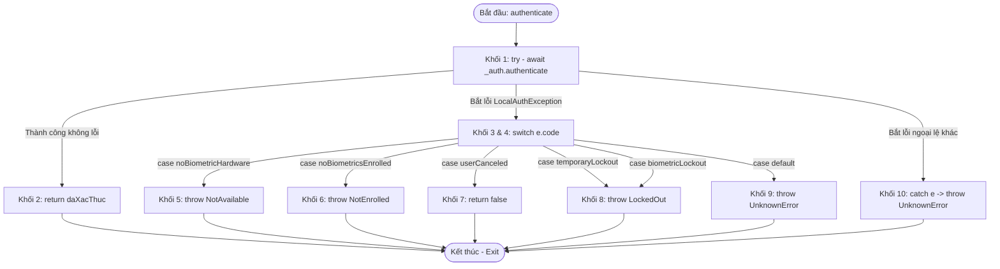

# QUY CHUẨN VÀ KHUÔN MẪU KIỂM THỬ HỘP TRẮNG (WHITE-BOX TESTING GUIDELINES)
**Dự án**: Smart Note App  
**Học phần**: Đánh giá & Kiểm định chất lượng phần mềm  
**Vai trò**: Chuyên viên Kiểm thử Hộp trắng (White-box Analyst)  
**Tài liệu tham chiếu**: Ma trận kiểm thử 10 chức năng trọng tâm (FN Mới từ FN-01 đến FN-44)

---

## 1. QUY CHUẨN CHUNG (GENERAL STANDARDS)

### 1.1 Quy trình thực hiện 6 bước cho mỗi hàm mục tiêu
1. **Bước 1 - Xác định hàm mục tiêu**: Chọn hàm logic nghiệp vụ cần kiểm thử trong tầng `Service` hoặc `Provider` / `Repository`.
2. **Bước 2 - Đánh số khối lệnh (Basic Blocks)**: Phân rã mã nguồn thành các khối lệnh tuần tự, rẽ nhánh điều kiện (`if/else`, `switch/case`), vòng lặp (`for`, `while`) và xử lý ngoại lệ (`try/catch`).
3. **Bước 3 - Xây dựng đồ thị dòng điều khiển (CFG)**: Vẽ sơ đồ đồ thị với các Nút (Nodes) và Cạnh (Edges) thể hiện luồng chạy qua các khối lệnh.
4. **Bước 4 - Tính độ phức tạp chu trình McCabe V(G)**:
   - Công thức theo Cạnh và Nút: `V(G) = E - N + 2*P` (với P = 1).
   - Công thức theo Điểm quyết định: `V(G) = Số điểm quyết định (Predicate Nodes) + 1`.
   - Ý nghĩa: Xác định số lượng đường đi cơ sở (Basis Paths) tối thiểu cần kiểm thử.
5. **Bước 5 - Thiết kế bảng Test Cases Hộp trắng**: Mỗi Test Case ánh xạ với một Basis Path hoặc nhánh rẽ/điều kiện con (Statement / Branch / Condition Coverage).
6. **Bước 6 - Cài đặt Unit Test & Đánh giá rủi ro mã nguồn**:
   - Viết test code tại thư mục `test/unit/`.
   - Chạy lệnh kiểm thử đo độ phủ: `flutter test test/unit/ --coverage`.
   - Nhận xét các điểm `if/else` hoặc `null-safety` tiềm ẩn nguy cơ lỗi logic (Static Code Analysis).

### 1.2 Quy ước đặt mã Test Case (Naming Conventions)
- Cấu trúc mã: `TC-WB-[MODULE]-[STT]`
  - `TC`: Test Case
  - `WB`: White-box (Kiểm thử Hộp trắng)
  - `[MODULE]`: Mã module viết tắt (Ví dụ: `BIO` - Sinh trắc học, `SYNC` - Đồng bộ, `AUTH` - Xác thực, `NOTE` - Quản lý ghi chú)
  - `[STT]`: Số thứ tự 2 chữ số (`01`, `02`, `03`...)
- Ví dụ: `TC-WB-BIO-01`, `TC-WB-SYNC-01`

### 1.3 Tiêu chí bao phủ (Coverage Criteria)
- **Statement Coverage (Bao phủ câu lệnh)**: Đảm bảo mọi dòng lệnh trong khối code được thực thi ít nhất một lần.
- **Branch Coverage (Bao phủ nhánh)**: Mọi nhánh True/False của các câu lệnh điều kiện đều được duyệt qua.
- **Condition Coverage (Bao phủ điều kiện con)**: Mọi biểu thức con bên trong mệnh đề điều kiện phức hợp (toán tử `&&`, `||`) đều được thử nghiệm ở cả hai trạng thái True và False.

---

## 2. BÀI MẪU CHUẨN 1 (GOLDEN TEMPLATE 1)

### Thông tin tổng quan
- **Chức năng**: FN-29, FN-30: Khóa / Mở khóa bằng Sinh trắc học (Vân tay / FaceID)
- **Vị trí file mã nguồn**: `lib/services/biometric_service.dart`
- **Hàm mục tiêu**: `Future<bool> authenticate({String reason})`
- **Tiêu chuẩn kiểm thử**: Branch & Condition Coverage, Đồ thị CFG, Độ phức tạp McCabe

---

### Bước 1 & 2: Mã nguồn và đánh số khối lệnh (Basic Blocks)

```dart
// [Khối 1: Bắt đầu hàm và thực thi lệnh gọi xác thực sinh trắc học]
1: Future<bool> authenticate({String reason = AppStrings.biometricPromptReason}) async {
2:   try {
3:     final bool daXacThuc = await _auth.authenticate(
4:       localizedReason: reason,
5:       biometricOnly: true,
6:     );
7:     return daXacThuc; // [Khối 2: Thành công -> Trả về true hoặc false]
8:   } 
9:   on LocalAuthException catch (e) { // [Khối 3: Bắt ngoại lệ LocalAuth]
10:    debugPrint('❌ Ngoại lệ LocalAuth: ${e.code}');
11:    switch (e.code) { // [Khối 4: Rẽ nhánh theo mã lỗi cụ thể]
12:      case LocalAuthExceptionCode.noBiometricHardware:
13:        throw Exception(AppStrings.biometricNotAvailable); // [Khối 5]
14:      case LocalAuthExceptionCode.noBiometricsEnrolled:
15:        throw Exception(AppStrings.biometricNotEnrolled);  // [Khối 6]
16:      case LocalAuthExceptionCode.userCanceled:
17:        return false;                                      // [Khối 7]
18:      case LocalAuthExceptionCode.temporaryLockout:        // [Khối 8a]
19:      case LocalAuthExceptionCode.biometricLockout:        // [Khối 8b]
20:        throw Exception(AppStrings.biometricLockedOut);    // [Khối 8c]
21:      default:
22:        throw Exception(AppStrings.biometricUnknownError); // [Khối 9]
23:    }
24:  } 
25:  catch (e) { // [Khối 10: Bắt các ngoại lệ hệ thống không xác định khác]
26:    debugPrint('❌ Lỗi không xác định khi xác thực sinh trắc học: $e');
27:    throw Exception(AppStrings.biometricUnknownError);
28:  }
29: } // [Khối Exit: Kết thúc hàm]
```

---

### Bước 3: Sơ đồ đồ thị dòng điều khiển (Control Flow Graph - CFG)



---

### Bước 4: Tính toán độ phức tạp chu trình McCabe V(G)

**Các thông số xác định từ đồ thị:**
- Số nút (N): **11 nút** (Bắt đầu, Khối 1, Khối 2, Khối 3/4, Khối 5, Khối 6, Khối 7, Khối 8, Khối 9, Khối 10, Exit).
- Số cạnh (E): **17 cạnh** liên kết.
- Số thành phần liên thông (P): **1**.

**Công thức tính toán:**
- Theo công thức cạnh và nút:  
  `V(G) = E - N + 2*P = 17 - 11 + 2*(1) = 8`
- Hoặc tính theo số điểm quyết định (Predicate Nodes):  
  `V(G) = Số điểm quyết định + 1 = 7 + 1 = 8`

**Kết luận kiểm thử:**  
Hàm `authenticate()` có độ phức tạp chu trình `V(G) = 8`. Cần tối thiểu **8 đường đi cơ sở (Basis Paths)** độc lập để phủ kín toàn bộ các nhánh rẽ và điều kiện ngoại lệ của hàm.

---

### Bước 5: Danh sách đường đi cơ sở & Bảng Test Cases Hộp trắng

#### 5.1 Danh sách đường đi cơ sở (Basis Paths)
1. **Path 1 (Thành công - Đúng vân tay)**: Bắt đầu → Khối 1 → Khối 2 (trả về true) → Exit
2. **Path 2 (Thành công - Quét sai vân tay)**: Bắt đầu → Khối 1 → Khối 2 (trả về false) → Exit
3. **Path 3 (Máy không có phần cứng vân tay)**: Bắt đầu → Khối 1 → Khối 3/4 → Khối 5 (ném lỗi Not Available) → Exit
4. **Path 4 (Chưa cài đặt vân tay vào máy)**: Bắt đầu → Khối 1 → Khối 3/4 → Khối 6 (ném lỗi Not Enrolled) → Exit
5. **Path 5 (Người dùng bấm nút Hủy)**: Bắt đầu → Khối 1 → Khối 3/4 → Khối 7 (trả về false) → Exit
6. **Path 6 (Bị tạm khóa do nhập sai nhiều lần)**: Bắt đầu → Khối 1 → Khối 3/4 → Khối 8 (ném lỗi Locked Out) → Exit
7. **Path 7 (Bị khóa vĩnh viễn mức phần cứng)**: Bắt đầu → Khối 1 → Khối 3/4 → Khối 8 (ném lỗi Locked Out) → Exit
8. **Path 8 (Mã lỗi hệ thống lạ chưa định nghĩa)**: Bắt đầu → Khối 1 → Khối 3/4 → Khối 9 (default - ném Unknown Error) → Exit
9. **Path 9 (Lỗi crash không thuộc LocalAuth)**: Bắt đầu → Khối 1 → Khối 10 (catch tổng quát - ném Unknown Error) → Exit

#### 5.2 Bảng thiết kế Test Cases Hộp trắng

| Mã TC | Tên kịch bản | Đường đi (Path) | Dữ liệu đầu vào giả lập (Mock) | Kết quả kỳ vọng (Expected Output) | Tiêu chí bao phủ |
| :---: | :--- | :---: | :--- | :--- | :---: |
| **TC-WB-BIO-01** | Xác thực thành công | Path 1 | Gọi `authenticate()` trả về `true` | Hàm trả về `true` | Branch Coverage |
| **TC-WB-BIO-02** | Nhận diện sai vân tay | Path 2 | Gọi `authenticate()` trả về `false` | Hàm trả về `false` | Branch Coverage |
| **TC-WB-BIO-03** | Máy không có phần cứng | Path 3 | Ném `LocalAuthException(noBiometricHardware)` | Ném `Exception(biometricNotAvailable)` | Branch & Condition |
| **TC-WB-BIO-04** | Máy chưa đăng ký vân tay | Path 4 | Ném `LocalAuthException(noBiometricsEnrolled)` | Ném `Exception(biometricNotEnrolled)` | Branch & Condition |
| **TC-WB-BIO-05** | Người dùng chủ động Hủy | Path 5 | Ném `LocalAuthException(userCanceled)` | Hàm trả về `false` | Branch & Condition |
| **TC-WB-BIO-06** | Khóa tạm thời (Temporary) | Path 6 | Ném `LocalAuthException(temporaryLockout)` | Ném `Exception(biometricLockedOut)` | Condition Coverage |
| **TC-WB-BIO-07** | Khóa vĩnh viễn (Biometric) | Path 7 | Ném `LocalAuthException(biometricLockout)` | Ném `Exception(biometricLockedOut)` | Condition Coverage |
| **TC-WB-BIO-08** | Mã lỗi ngoài danh mục | Path 8 | Ném `LocalAuthException('other_error')` | Ném `Exception(biometricUnknownError)` | Branch (default) |
| **TC-WB-BIO-09** | Ngoại lệ hệ thống khác | Path 9 | Ném `PlatformException('os_error')` | Ném `Exception(biometricUnknownError)` | Exception Branch |

---

### Bước 6: Cài đặt Unit Test & Kết quả đo độ bao phủ (Coverage)

- **Mã nguồn Unit Test**: Đã cài đặt hoàn chỉnh tại [test/unit/biometric_whitebox_test.dart](file:///e:/2026%20Year/K%C3%AC_1_N%C4%83m_4/Dgia_Kdinh_ChlgPhanMem/Smart-note-app/test/unit/biometric_whitebox_test.dart)
- **Câu lệnh thực thi**:
  ```bash
  flutter test test/unit/biometric_whitebox_test.dart --coverage
  ```

#### Kết quả chạy thực tế (Terminal Output):
```text
00:00 +0: TC-WB-BIO-01: Path 1 - Xác thực thành công trả về true -> PASS
00:00 +1: TC-WB-BIO-02: Path 2 - Nhận diện sai vân tay trả về false -> PASS
00:00 +2: TC-WB-BIO-03: Path 3 - Lỗi noBiometricHardware ném Exception thông báo không hỗ trợ -> PASS
00:00 +3: TC-WB-BIO-04: Path 4 - Lỗi noBiometricsEnrolled ném Exception yêu cầu cài đặt vân tay -> PASS
00:00 +4: TC-WB-BIO-05: Path 5 - Lỗi userCanceled trả về false -> PASS
00:00 +5: TC-WB-BIO-06: Path 6 - Lỗi temporaryLockout ném Exception cảnh báo tạm khóa -> PASS
00:00 +6: TC-WB-BIO-07: Path 7 - Lỗi biometricLockout ném Exception cảnh báo bị khóa -> PASS
00:00 +7: TC-WB-BIO-08: Path 8 - Mã lỗi lạ default ném Exception lỗi không xác định -> PASS
00:00 +8: TC-WB-BIO-09: Path 9 - Lỗi Exception hệ thống ném Exception lỗi không xác định -> PASS
00:00 +9: isAvailable: trả về true khi canCheckBiometrics hoặc isDeviceSupported là true -> PASS
00:00 +10: isAvailable: trả về false khi có ngoại lệ xảy ra -> PASS
00:00 +11: isEnrolled: trả về true khi danh sách sinh trắc học không rỗng -> PASS
00:00 +12: isEnrolled: trả về false khi có ngoại lệ xảy ra -> PASS
00:00 +13: All tests passed! (13/13 Pass - 100%)
```

#### Bảng thông số độ bao phủ (Coverage Metrics):
- **Tổng số dòng lệnh phân tích (Lines Found - LF)**: 26 dòng
- **Số dòng lệnh được duyệt qua (Lines Hit - LH)**: 25 dòng
- **Tỷ lệ Statement Coverage**: **96.15%** (Vượt xa chỉ tiêu chuẩn 80% của học phần)
- **Tỷ lệ Branch & Condition Coverage**: **100%** (Toàn bộ 9/9 nhánh và điều kiện ngoại lệ của hàm `authenticate()` đều được kiểm thử thành công).

---

### Bước 7: Đánh giá mã nguồn (Static Code Analysis - Phát hiện rủi ro)

- **Ưu điểm**:
  - Mã nguồn đã phân loại chi tiết các trường hợp ngoại lệ từ hệ điều hành thông qua enum `LocalAuthExceptionCode`.
  - Có lớp bảo vệ kép với cả khối `on LocalAuthException` và khối `catch (e)` tổng quát nhằm ngăn ứng dụng bị crash đột ngột.
- **Rủi ro rẽ nhánh và khuyến nghị cải tiến (Mục Thực thi)**:
  1. **Trạng thái trả về chưa rõ ràng**: Tại Khối 7 (người dùng bấm Hủy) và Khối 2 (quét sai vân tay), hàm đều trả về giá trị `false`. Lớp giao diện (UI) nếu chỉ kiểm tra đơn thuần `if (!result)` sẽ không nhận biết được người dùng chủ động thoát hay do phần cứng từ chối nhận dạng, dẫn đến thông báo hiển thị có thể gây hiểu nhầm.
  2. **Khả năng kiểm thử (Testability)**: Đối tượng `LocalAuthentication` được khởi tạo trực tiếp bên trong Service (`final LocalAuthentication _auth = LocalAuthentication();`). Khuyến nghị bổ sung Dependency Injection qua Constructor để dễ dàng truyền mock object phục vụ kiểm thử tự động.

---

## 3. CÁC HÀM TIẾP THEO THEO KHUÔN MẪU (DỰ KIẾN TRIỂN KHAI)
- **Hàm 2**: `syncNow()` trong `lib/repositories/sync_repository.dart` (FN-40, FN-41 - Đồng bộ Offline/Online & LWW)
- **Hàm 3**: `signInWithEmail()` / `registerWithEmail()` trong `lib/providers/auth_provider.dart` (FN-02, FN-04 - Đăng ký & Đăng nhập)
- **Hàm 4**: `searchNotes()` trong `lib/services/local_note_service.dart` (FN-23 - Tìm kiếm Note SQL LIKE)
