# BÁO CÁO KIỂM THỬ HỘP TRẮNG (WHITE-BOX TESTING REPORT)
**Học phần**: Đánh giá & Kiểm định chất lượng phần mềm  
**Đề tài**: Smart Note App  
**Sinh viên thực hiện**: Dũng — Chuyên viên Kiểm thử Hộp trắng (White-box Analyst)  
**Repository**: `https://github.com/ttthu-huong/Smart-Note-App-QA` (Nhánh: `dung`)  
**Phương châm**: *"Góc nhìn từ bên trong: Lật tung cấu trúc mã nguồn, đo lường toàn diện rẽ nhánh và bảo đảm chất lượng phần mềm đạt chuẩn tối đa!"*

---

## 📑 MỤC LỤC BÁO CÁO

### [PHẦN A: HỒ SƠ NGHIỆM THU KIỂM THỬ HỘP TRẮNG (QA DELIVERABLES)](#phần-a-hồ-sơ-nghiệm-thu-kiểm-thử-hộp-trắng)
1. **[Mục 1: Test Execution Result (Kết quả Thực thi Kiểm thử)](#1-test-execution-result-kết-quả-thực-thi-kiểm-thử)**
   - 1.1 Tổng quan Kết quả Thực thi Hệ thống (83/83 PASS - 100%)
   - 1.2 Bảng Chi tiết 83 Test Cases Hộp trắng (Input, Expected, Actual, Status)
2. **[Mục 2: Bug Report (Báo cáo Lỗi & Khuyết tật Mã nguồn)](#2-bug-report-báo-cáo-lỗi--khuyết-tật-mã-nguồn)**
   - 2.1 Trạng thái Lỗi Thực thi (Execution Defect Status)
   - 2.2 Bảng Ghi nhận & Khắc phục Khuyết tật Mã nguồn (Defects & Code Smells Identified)
3. **[Mục 3: Coverage Report (Báo cáo Đo lường Độ bao phủ Mã nguồn)](#3-coverage-report-báo-cáo-đo-lường-độ-bao-phủ-mã-nguồn)**
   - 3.1 Bảng Tổng hợp Độ bao phủ (Statement, Branch, Condition & Basis Path Coverage)
   - 3.2 Đánh giá Chi tiết Từng Module theo Chuẩn Môn học (Vượt chuẩn >= 80%)
4. **[Mục 4: Evidence (Minh chứng Thực nghiệm Đầy đủ)](#4-evidence-minh-chứng-thực-nghiệm-đầy-đủ)**
   - 4.1 Minh chứng Thực thi Terminal (Ảnh chụp Terminal thực tế từ hệ thống)
   - 4.2 Minh chứng Bảng đo lường Coverage HTML (Nền trắng chuẩn hóa)
   - 4.3 Log Thực thi Toàn diện 83 Tests
5. **[Mục 5: Test Code (Danh mục Mã nguồn Kiểm thử)](#5-test-code-danh-mục-mã-nguồn-kiểm-thử)**
   - 5.1 Cấu trúc Thư mục Lưu trữ Test Code
   - 5.2 Bảng Thống kê 6 Bộ File Unit Test (.dart)

---

### [PHẦN B: TÀI LIỆU KỸ THUẬT CHUYÊN SÂU (CFG, MCCABE & BASIS PATHS)](#phần-b-tài-liệu-kỹ-thuật-chuyên-sâu)
- [Chức năng 1: Khóa / Mở khóa Sinh trắc học (FN-29, FN-30)](#chức-năng-1-khóa--mở-khóa-sinh-trắc-học-fn-29-fn-30)
- [Chức năng 2: Đồng bộ Offline/Online & Thuật toán LWW (FN-40, FN-41)](#chức-năng-2-đồng-bộ-offlineonline--thuật-toán-lww-fn-40-fn-41)
- [Chức năng 3 & 4: Đăng ký & Đăng nhập Email/Mật khẩu (FN-02, FN-04)](#chức-năng-3--4-đăng-ký--đăng-nhập-emailmật-khẩu-fn-02-fn-04)
- [Chức năng 5 & 6: Tạo Note & Sửa Note (FN-08, FN-09)](#chức-năng-5--6-tạo-note--sửa-note-fn-08-fn-09)
- [Chức năng 7: Xóa Note, Khôi phục & Thùng rác (FN-10, FN-11, FN-12)](#chức-năng-7-xóa-note-khôi-phục--thùng-rác-fn-10-fn-11-fn-12)
- [Chức năng 8: Tìm kiếm Note Đa năng theo Cú pháp (FN-23)](#chức-năng-8-tìm-kiếm-note-đa-năng-theo-cú-pháp-fn-23)

---

# PHẦN A: HỒ SƠ NGHIỆM THU KIỂM THỬ HỘP TRẮNG

## 1. TEST EXECUTION RESULT (KẾT QUẢ THỰC THI KIỂM THỬ)

### 1.1 Tổng quan Kết quả Thực thi Hệ thống
- **Tổng số Test Cases thiết kế & thực thi**: **83 Test Cases**
- **Số Test Cases ĐẠT (PASS)**: **83 / 83 (100.0%)**
- **Số Test Cases THẤT BẠI (FAIL)**: **0 (0.0%)**
- **Số Test Cases BỊ CHẶN (BLOCKED)**: **0 (0.0%)**
- **Thời gian thực thi toàn bộ test suite**: **2.4 giây - 3.5 giây**
- **Đánh giá tổng quát**: Toàn bộ các nhánh rẽ điều kiện, các kịch bản ngoại lệ, phân xử xung đột dữ liệu và logic nghiệp vụ đều vượt qua kiểm thử thành công tuyệt đối.

### 1.2 Bảng Chi tiết 83 Test Cases Hộp trắng

#### Nhóm 1: Khóa / Mở Sinh trắc học (FN-29, FN-30) — `biometric_whitebox_test.dart`
| Mã TC | Tên kịch bản | Dữ liệu đầu vào giả lập (Input/Mock) | Kết quả kỳ vọng (Expected Result) | Kết quả thực tế (Actual Result) | Trạng thái (Status) |
| :---: | :--- | :--- | :--- | :--- | :---: |
| **TC-WB-BIO-01** | Xác thực vân tay thành công | `authenticate()` trả về `true` | Hàm trả về `true`, prompt đúng lý do | Trả về `true`, prompt hiển thị chuẩn | **PASS** 🟢 |
| **TC-WB-BIO-02** | Quét sai vân tay | `authenticate()` trả về `false` | Hàm trả về `false`, không văng ngoại lệ | Trả về `false` an toàn | **PASS** 🟢 |
| **TC-WB-BIO-03** | Máy không có phần cứng | Ném `LocalAuthException(noBiometricHardware)` | Ném `Exception(biometricNotAvailable)` | Bắt ngoại lệ, ném đúng thông báo lỗi | **PASS** 🟢 |
| **TC-WB-BIO-04** | Máy chưa đăng ký vân tay | Ném `LocalAuthException(noBiometricsEnrolled)` | Ném `Exception(biometricNotEnrolled)` | Bắt ngoại lệ, ném lỗi chưa đăng ký | **PASS** 🟢 |
| **TC-WB-BIO-05** | Người dùng chủ động Hủy | Ném `LocalAuthException(userCanceled)` | Hàm trả về `false`, không ném lỗi | Trả về `false` an toàn | **PASS** 🟢 |
| **TC-WB-BIO-06** | Khóa tạm thời (Temporary) | Ném `LocalAuthException(temporaryLockout)` | Ném `Exception(biometricLockedOut)` | Ném đúng ngoại lệ Lockout | **PASS** 🟢 |
| **TC-WB-BIO-07** | Khóa vĩnh viễn (Lockout) | Ném `LocalAuthException(biometricLockout)` | Ném `Exception(biometricLockedOut)` | Ném đúng ngoại lệ Lockout | **PASS** 🟢 |
| **TC-WB-BIO-08** | Mã lỗi hệ thống lạ | Ném `LocalAuthException(uiUnavailable)` | Ném `Exception(biometricUnknownError)` | Rẽ nhánh default, ném lỗi chung | **PASS** 🟢 |
| **TC-WB-BIO-09** | Ngoại lệ crash OS khác | Ném `Exception('OS Crash Fatal')` | Ném `Exception(biometricUnknownError)` | Khối catch tổng quát bắt và bọc lỗi | **PASS** 🟢 |
| **TC-WB-BIO-10** | Kiểm tra phần cứng: Có hỗ trợ | `canCheckBiometrics = true`, `isDeviceSupported = true` | `isAvailable()` trả về `true` | Trả về `true` | **PASS** 🟢 |
| **TC-WB-BIO-11** | Kiểm tra phần cứng: Bị lỗi OS | Mock ném ngoại lệ khi kiểm tra | `isAvailable()` trả về `false` an toàn | Trả về `false` | **PASS** 🟢 |
| **TC-WB-BIO-12** | Đã đăng ký vân tay trong máy | `getAvailableBiometrics()` trả về danh sách có phần tử | `isEnrolled()` trả về `true` | Trả về `true` | **PASS** 🟢 |
| **TC-WB-BIO-13** | Ngoại lệ khi lấy danh sách sinh trắc | `getAvailableBiometrics()` ném lỗi | `getAvailableBiometrics()` trả về mảng rỗng | Trả về `[]` an toàn không crash | **PASS** 🟢 |

#### Nhóm 2: Đồng bộ Offline/Online & Thuật toán LWW (FN-40, FN-41) — `sync_whitebox_test.dart`
| Mã TC | Tên kịch bản | Dữ liệu đầu vào giả lập (Input/Mock) | Kết quả kỳ vọng (Expected Result) | Kết quả thực tế (Actual Result) | Trạng thái (Status) |
| :---: | :--- | :--- | :--- | :--- | :---: |
| **TC-WB-SYNC-01** | Chặn đồng bộ song song (Sync Lock) | `_syncLock` đang bận tiến trình trước | Hàm trả về `false`, không chạy đè | Bỏ qua luồng mới, trả về `false` | **PASS** 🟢 |
| **TC-WB-SYNC-02** | Đồng bộ sạch (Không có thay đổi) | 0 pending, dữ liệu Local & Cloud khớp nhau | Trả về `false`, trạng thái syncing -> success | Trả về `false`, cập nhật `success` | **PASS** 🟢 |
| **TC-WB-SYNC-03** | LWW Push: Note mới ở Local | Note Local có, Cloud chưa có (`cloud == null`) | Gọi `batchSaveNotes()`, SQLite `is_synced = 1` | Đẩy Firestore, cập nhật `is_synced` | **PASS** 🟢 |
| **TC-WB-SYNC-04** | LWW Push: Local có bản sửa mới hơn | `local.updatedAt > cloud.updatedAt` | Note Local đẩy lên đè Cloud | Ghi đè Firestore thành công | **PASS** 🟢 |
| **TC-WB-SYNC-05** | LWW Conflict: Cloud mới hơn Local | `cloud.updatedAt > local.updatedAt` | Chặn push Local; kéo Cloud đè SQLite | Giữ bản Cloud, cập nhật Local SQLite | **PASS** 🟢 |
| **TC-WB-SYNC-06** | LWW Pull: Note mới từ Cloud | Cloud có note mới, Local chưa có | Gọi SQLite `insert()`, trả về `true` | Thêm mới vào SQLite, return `true` | **PASS** 🟢 |
| **TC-WB-SYNC-07** | LWW Pull: Cloud sửa mới hơn Local | Cloud có `updatedAt` lớn hơn Local | Gọi SQLite `update()`, trả về `true` | Cập nhật SQLite, return `true` | **PASS** 🟢 |
| **TC-WB-SYNC-08** | LWW Pull: Local mới hơn hoặc bằng | Local có `updatedAt` >= Cloud | Giữ nguyên Local, không ghi đè SQLite | Không cập nhật, giữ bản Local mới nhất | **PASS** 🟢 |
| **TC-WB-SYNC-09** | Xử lý hàng đợi xóa khi Offline | Hàng đợi có 2 ID `p_1`, `p_2` | Xóa 2 note Firestore & xóa khỏi queue | Dọn sạch Firestore và xóa pending queue | **PASS** 🟢 |
| **TC-WB-SYNC-10** | Ngoại lệ mạng Firestore timeout | Firestore ném `TimeoutException` | Phát `SyncStatus.error`, giải phóng lock | Bắn trạng thái error, lock mở an toàn | **PASS** 🟢 |
| **TC-WB-SYNC-11** | Bổ trợ: pullFromCloud đồng bộ nền | Firestore trả về danh sách ghi chú mới | Lưu SQLite và phát `hasNewChanges=true` | SQLite lưu đủ, phát cờ thay đổi | **PASS** 🟢 |

#### Nhóm 3: Đăng ký & Đăng nhập Email/Mật khẩu (FN-02, FN-04) — `auth_whitebox_test.dart`
| Mã TC | Tên kịch bản | Dữ liệu đầu vào giả lập (Input/Mock) | Kết quả kỳ vọng (Expected Result) | Kết quả thực tế (Actual Result) | Trạng thái (Status) |
| :---: | :--- | :--- | :--- | :--- | :---: |
| **TC-WB-AUTH-01** | Đăng ký thành công | Email & Password hợp lệ | Trả về `true`, `isLoading=false`, `currentUser != null` | Trả về `true`, lưu user thành công | **PASS** 🟢 |
| **TC-WB-AUTH-02** | Đăng ký: Email đã tồn tại | Firebase ném `email-already-in-use` | Trả về `false`, `errorMessage = emailAlreadyInUse` | Báo lỗi email đã được sử dụng | **PASS** 🟢 |
| **TC-WB-AUTH-03** | Đăng ký: Định dạng email sai | Firebase ném `invalid-email` | Trả về `false`, `errorMessage = invalidEmail` | Báo lỗi email không hợp lệ | **PASS** 🟢 |
| **TC-WB-AUTH-04** | Đăng ký: Mật khẩu quá yếu | Firebase ném `weak-password` | Trả về `false`, `errorMessage = weakPassword` | Báo lỗi mật khẩu quá yếu | **PASS** 🟢 |
| **TC-WB-AUTH-05** | Đăng ký: Ngoại lệ FirebaseAuth khác | Firebase ném `operation-not-allowed` | Trả về `false`, thông báo lỗi dịch tiếng Việt | Trả về `false`, bọc lỗi tiếng Việt | **PASS** 🟢 |
| **TC-WB-AUTH-06** | Đăng ký: Lỗi hệ thống ngoài dự kiến | Ném `Exception('Socket error')` | Trả về `false`, `errorMessage = unknownError` | Bắt lỗi tổng quát, không văng ứng dụng | **PASS** 🟢 |
| **TC-WB-AUTH-07** | Đăng ký: User trả về null | `createUserWithEmailAndPassword` trả về user null | Trả về `false`, `errorMessage = unknownError` | Kiểm tra an toàn null-safety thành công | **PASS** 🟢 |
| **TC-WB-AUTH-08** | Đăng nhập thành công | Email & Password chính xác | Trả về `true`, `isLoading=false`, `errorMessage=null` | Đăng nhập thành công, xóa sạch error | **PASS** 🟢 |
| **TC-WB-AUTH-09** | Đăng nhập: Sai mật khẩu | Firebase ném `wrong-password` | Trả về `false`, `errorMessage = wrongPassword` | Báo lỗi sai mật khẩu | **PASS** 🟢 |
| **TC-WB-AUTH-10** | Đăng nhập: Tài khoản không tồn tại | Firebase ném `user-not-found` | Trả về `false`, `errorMessage = userNotFound` | Báo lỗi tài khoản không tồn tại | **PASS** 🟢 |
| **TC-WB-AUTH-11** | Đăng nhập: Tài khoản bị khóa | Firebase ném `user-disabled` | Trả về `false`, `errorMessage = userDisabled` | Báo lỗi tài khoản bị vô hiệu hóa | **PASS** 🟢 |
| **TC-WB-AUTH-12** | Đăng nhập: Spam quá nhiều lần | Firebase ném `too-many-requests` | Trả về `false`, `errorMessage = tooManyRequests` | Báo lỗi đăng nhập sai quá nhiều lần | **PASS** 🟢 |
| **TC-WB-AUTH-13** | Đăng nhập: Lỗi hệ thống chung | Ném `Exception('Network timeout')` | Trả về `false`, `errorMessage = unknownError` | Bắt lỗi tổng quát an toàn | **PASS** 🟢 |
| **TC-WB-AUTH-14** | Đăng nhập: User trả về null | `signInWithEmailAndPassword` trả về user null | Trả về `false`, `errorMessage = unknownError` | Kiểm tra an toàn null-safety thành công | **PASS** 🟢 |
| **TC-WB-AUTH-15** | Validate Email: Hợp lệ | `test@gmail.com` | Trả về `true` | Trả về `true` | **PASS** 🟢 |
| **TC-WB-AUTH-16** | Validate Email: Rỗng / Space | `""`, `"   "` | Trả về `false` | Trả về `false` | **PASS** 🟢 |
| **TC-WB-AUTH-17** | Validate Email: Thiếu @ hoặc domain | `testgmail.com`, `test@` | Trả về `false` | Trả về `false` | **PASS** 🟢 |
| **TC-WB-AUTH-18** | Dịch mã lỗi: network-request-failed | `FirebaseAuthException('network-request-failed')` | Trả về `AppStrings.networkError` | Dịch chuẩn thông báo lỗi mạng | **PASS** 🟢 |
| **TC-WB-AUTH-19** | Dịch mã lỗi: invalid-credential | `FirebaseAuthException('invalid-credential')` | Trả về `AppStrings.invalidCredential` | Dịch chuẩn lỗi thông tin không khớp | **PASS** 🟢 |
| **TC-WB-AUTH-20** | Dịch mã lỗi lạ không xác định | `FirebaseAuthException('unknown-code')` | Trả về `AppStrings.unknownError` | Rẽ nhánh default, trả lỗi chung | **PASS** 🟢 |
| **TC-WB-AUTH-21** | Reset trạng thái lỗi | Gọi `clearError()` | `errorMessage = null`, thông báo listener | Xóa sạch cờ lỗi, notifyListeners | **PASS** 🟢 |

#### Nhóm 4: Tạo Note & Sửa Note (FN-08, FN-09) — `note_crud_whitebox_test.dart`
| Mã TC | Tên kịch bản | Dữ liệu đầu vào giả lập (Input/Mock) | Kết quả kỳ vọng (Expected Result) | Kết quả thực tế (Actual Result) | Trạng thái (Status) |
| :---: | :--- | :--- | :--- | :--- | :---: |
| **TC-WB-CRUD-01** | Tạo mới Note khi Online | `canSync = true`, note chưa có trong SQLite | Lưu SQLite, đẩy Firestore, `is_synced = 1` | Lưu SQLite & Cloud thành công | **PASS** 🟢 |
| **TC-WB-CRUD-02** | Sửa Note khi Online | `canSync = true`, note đã có trong SQLite | Cập nhật SQLite, ghi đè Firestore, `is_synced = 1` | Cập nhật cả 2 nguồn dữ liệu | **PASS** 🟢 |
| **TC-WB-CRUD-03** | Tạo mới Note khi Offline | `canSync = false` | Lưu SQLite với `is_synced = 0`, không gọi Firestore | Lưu Local an toàn, chờ sync | **PASS** 🟢 |
| **TC-WB-CRUD-04** | Sửa Note khi Offline | `canSync = false` | Cập nhật SQLite với `is_synced = 0`, không gọi Firestore | Cập nhật Local an toàn, chờ sync | **PASS** 🟢 |
| **TC-WB-CRUD-05** | Firestore ném lỗi mạng | Firestore ném `TimeoutException` | Bắt lỗi, SQLite vẫn lưu an toàn, `is_synced = 0` | Không văng lỗi, bảo vệ dữ liệu Local | **PASS** 🟢 |
| **TC-WB-CRUD-06** | DAL: insertNote SQLite | Gọi `LocalNoteService.insertNote()` | Gọi SQLite `insert(conflictAlgorithm: replace)` | Insert thành công vào SQLite | **PASS** 🟢 |
| **TC-WB-CRUD-07** | DAL: updateNote SQLite | Gọi `LocalNoteService.updateNote()` | Gọi SQLite `update()` theo ID ghi chú | Update thành công vào SQLite | **PASS** 🟢 |
| **TC-WB-CRUD-08** | Model Note: toMap() serialization | Đối tượng `Note` hợp lệ đầy đủ tags, urls | Chuyển đổi Map chứa đúng kiểu dữ liệu SQLite | Map chuẩn hóa JSON và String | **PASS** 🟢 |
| **TC-WB-CRUD-09** | Model Note: fromMap() deserialization | Map dữ liệu đọc từ SQLite | Khôi phục đúng đối tượng `Note` với đầy đủ thuộc tính | Khôi phục chính xác 100% thuộc tính | **PASS** 🟢 |
| **TC-WB-CRUD-10** | Model Note: copyWith() bất biến | Gọi `note.copyWith(title: 'Tiêu đề mới')` | Trả về note mới với title thay đổi, thuộc tính khác giữ nguyên | Tạo bản sao bất biến chuẩn xác | **PASS** 🟢 |

#### Nhóm 5: Xóa Note, Khôi phục & Thùng rác (FN-10, FN-11, FN-12) — `trash_whitebox_test.dart`
| Mã TC | Tên kịch bản | Dữ liệu đầu vào giả lập (Input/Mock) | Kết quả kỳ vọng (Expected Result) | Kết quả thực tế (Actual Result) | Trạng thái (Status) |
| :---: | :--- | :--- | :--- | :--- | :---: |
| **TC-WB-TRASH-01** | Xóa Soft-delete Note thường | Note thường có trạng thái `normal` | `status='trash'`, hủy reminder, lưu DB | Chuyển vào thùng rác, hủy nhắc nhở | **PASS** 🟢 |
| **TC-WB-TRASH-02** | Xóa Soft-delete Note đang ghim | Note ghim có `status='pinned'` | Gỡ khỏi pinned, vào trash, lưu DB | Hủy ghim và chuyển vào thùng rác | **PASS** 🟢 |
| **TC-WB-TRASH-03** | Xóa Note không tồn tại trong RAM | ID lạ không có trong danh sách memory | Hủy reminder, an toàn không crash DB | Bỏ qua an toàn, không văng lỗi | **PASS** 🟢 |
| **TC-WB-TRASH-04** | Khôi phục Note từ Thùng rác | Note nằm trong danh sách `_trashNotes` | `status='normal'`, chuyển về danh sách chính, lưu DB | Khôi phục thành công về màn hình chính | **PASS** 🟢 |
| **TC-WB-TRASH-05** | Khôi phục Note không tồn tại | ID lạ không có trong Thùng rác | Bỏ qua an toàn, không gọi DB | Không gọi DB, giữ an toàn hệ thống | **PASS** 🟢 |
| **TC-WB-TRASH-06** | Xóa vĩnh viễn Note có Media | Note chứa danh sách ảnh & ghi âm Cloudinary | Xóa Cloudinary, gỡ khỏi RAM, xóa SQLite | Dọn sạch Cloud và xóa Local | **PASS** 🟢 |
| **TC-WB-TRASH-07** | Xóa vĩnh viễn Note không có RAM | ID note đã bị giải phóng khỏi RAM | Bỏ qua dọn Cloud, vẫn xóa sạch SQLite | SQLite xóa sạch bản ghi | **PASS** 🟢 |
| **TC-WB-TRASH-08** | Cloudinary lỗi timeout khi dọn rác | Cloudinary ném `TimeoutException` | Bắt try/catch, SQLite vẫn xóa thành công | Không văng crash, SQLite xóa sạch | **PASS** 🟢 |
| **TC-WB-TRASH-09** | Tự động dọn rác sau 7 ngày | 1 note cũ 8 ngày + 1 note mới 2 ngày | Note 8 ngày tự xóa vĩnh viễn, note 2 ngày giữ lại | Xóa đúng note >= 7 ngày | **PASS** 🟢 |
| **TC-WB-TRASH-10** | Xóa vĩnh viễn DB khi Online | `canSync = true` | Xóa SQLite & Firestore, remove queue | Xóa sạch cả 2 cơ sở dữ liệu | **PASS** 🟢 |
| **TC-WB-TRASH-11** | Xóa vĩnh viễn DB khi Offline | `canSync = false` | Xóa SQLite, đưa vào `pendingDelete` queue | Lưu vào hàng đợi xóa khi có mạng | **PASS** 🟢 |
| **TC-WB-TRASH-12** | Xóa vĩnh viễn khi Firestore lỗi | Firestore ném Exception | Bắt lỗi, dự phòng đưa vào `pendingDelete` queue | Đưa vào hàng đợi dự phòng | **PASS** 🟢 |
| **TC-WB-TRASH-13** | Quản lý chọn / bỏ chọn Thùng rác | Gọi `toggleTrashSelection()`, `clear()` | Quản lý đúng danh sách ID được chọn | Cập nhật chính xác tập ID chọn | **PASS** 🟢 |
| **TC-WB-TRASH-14** | Thao tác hàng loạt thùng rác | Chọn nhiều note: khôi phục & xóa sạch | Khôi phục & Xóa vĩnh viễn hàng loạt chính xác | Thao tác hàng loạt hoàn tất 100% | **PASS** 🟢 |

#### Nhóm 6: Tìm kiếm Note Đa năng theo Cú pháp (FN-23) — `search_whitebox_test.dart`
| Mã TC | Tên kịch bản | Dữ liệu đầu vào giả lập (Input/Mock) | Kết quả kỳ vọng (Expected Result) | Kết quả thực tế (Actual Result) | Trạng thái (Status) |
| :---: | :--- | :--- | :--- | :--- | :---: |
| **TC-WB-SRCH-01** | Truy vấn chuỗi rỗng / dấu cách | `query = "   "` | Gọi `getAllNotes()`, tải danh sách đầy đủ | Trả về danh sách đầy đủ | **PASS** 🟢 |
| **TC-WB-SRCH-02** | Tìm kiếm theo Tiêu đề (Title) | `query = "Flutter"` | SQL LIKE `%flutter%` trên cột `title` | Khớp đúng ghi chú có tiêu đề Flutter | **PASS** 🟢 |
| **TC-WB-SRCH-03** | Tìm kiếm theo Nội dung (Content) | `query = "mccabe"` | SQL LIKE `%mccabe%` trên cột `content` | Khớp đúng ghi chú chứa từ khóa nội dung | **PASS** 🟢 |
| **TC-WB-SRCH-04** | Tìm kiếm không phân biệt hoa thường | `query = "FLUTTER"` | Khớp chính xác ghi chú dù viết hoa hay thường | So khớp thành công không phụ thuộc Case | **PASS** 🟢 |
| **TC-WB-SRCH-05** | Tự động loại trừ ghi chú Thùng rác | `query = "ghi chú"` | Mệnh đề SQL `status != 'trash'` chặn rác | Không hiển thị ghi chú nằm trong Thùng rác | **PASS** 🟢 |
| **TC-WB-SRCH-06** | Lọc ghi chú có hình ảnh `has:image` | `query = "has:image"` | Chỉ trả về ghi chú có `imageUrls` không rỗng | Lọc chính xác ghi chú có ảnh đính kèm | **PASS** 🟢 |
| **TC-WB-SRCH-07** | Lọc ghi chú có âm thanh `has:audio` | `query = "has:audio"` | Chỉ trả về ghi chú có `audioUrls` không rỗng | Lọc chính xác ghi chú có bản ghi âm | **PASS** 🟢 |
| **TC-WB-SRCH-08** | Lọc ghi chú chứa link `has:url` | `query = "has:url"` | Khớp URL Regex `https?:\/\/...` trong content | Lọc chính xác ghi chú chứa đường link web | **PASS** 🟢 |
| **TC-WB-SRCH-09** | Lọc ghi chú được ghim `is:pinned` | `query = "is:pinned"` | Chỉ trả về note có `status == 'pinned'` | Lọc đúng danh sách ghi chú đang ghim | **PASS** 🟢 |
| **TC-WB-SRCH-10** | Lọc note lưu trữ `is:archived` | `query = "is:archived"` | Lọc chính xác note `archived`, ẩn khi không tìm | Hiện đúng note archived khi có token | **PASS** 🟢 |
| **TC-WB-SRCH-11** | Bóc tách nhãn `label:"Thiết kế"` | `query = 'label:"Thiết kế"'` | Trích xuất nhãn qua Regex, khớp mảng `tags` | Khớp chính xác ghi chú có gắn thẻ nhãn | **PASS** 🟢 |
| **TC-WB-SRCH-12** | Kết hợp Văn bản + Token Filter | `query = "Figma has:image"` | Lọc văn bản SQL trước, lọc có ảnh sau | Kết hợp 2 tầng lọc chuẩn xác | **PASS** 🟢 |
| **TC-WB-SRCH-13** | Debounce Timer ở tầng UI Provider | Gõ ký tự tìm kiếm trên giao diện | `isSearching=true`, debounce 400ms gọi Repo | Bật cờ tìm kiếm, hoãn gọi DB 400ms | **PASS** 🟢 |
| **TC-WB-SRCH-14** | Xóa tìm kiếm và Reset State | Người dùng bấm nút Clear search | `isSearching=false`, xóa sạch mảng kết quả | Reset state về trạng thái ban đầu mượt mà | **PASS** 🟢 |

---

## 2. BUG REPORT (BÁO CÁO LỖI & KHUYẾT TẬT MÃ NGUỒN)

### 2.1 Trạng thái Lỗi Thực thi (Execution Defect Status)
> **Kết luận nghiệm thu**: Toàn bộ **83/83 Test Cases** đều đạt kết quả **PASS**. Không có ca kiểm thử nào bị thất bại (FAIL) do lỗi logic hay văng lỗi ứng dụng ngoài kiểm soát.

### 2.2 Bảng Ghi nhận & Khắc phục Khuyết tật Mã nguồn (Defects & Code Smells Identified)
Trong quá trình Chuyên viên Hộp trắng lật tung mã nguồn (Static Code Analysis & Testability Refactoring) trước và trong khi thiết kế các Basis Paths, nhóm kiểm thử đã phát hiện **5 khuyết tật kiến trúc tiềm ẩn** và đã trực tiếp tối ưu, khắc phục thành công:

| Mã Defect | Vị trí File | Mức độ | Mô tả khuyết tật phát hiện | Hậu quả tiềm ẩn | Giải pháp đã khắc phục (Refactoring) | Trạng thái |
| :---: | :--- | :---: | :--- | :--- | :--- | :---: |
| **DEF-WB-01** | `lib/services/biometric_service.dart` | **Medium** | Khởi tạo cứng `final LocalAuthentication _auth = LocalAuthentication();` bên trong class (Tight Coupling). | Không thể thay thế Mock Object khi viết Unit Test, buộc phải phụ thuộc phần cứng thiết bị thật. | Bổ sung Constructor Dependency Injection: `BiometricService({LocalAuthentication? auth})`. | **RESOLVED** ✅ |
| **DEF-WB-02** | `lib/repositories/sync_repository.dart` | **High** | Thiếu cơ chế khóa phiên đồng bộ (Concurrency Lock) khi gọi `syncNow()`. | Nếu người dùng bấm nút Đồng bộ liên tục hoặc luồng chạy tự động kích hoạt song song, dữ liệu sẽ bị Race Condition ghi đè sai lệch. | Cài đặt khóa phiên `_syncLock = Completer<void>()` ngăn chặn triệt để mọi luồng gọi đè. | **RESOLVED** ✅ |
| **DEF-WB-03** | `lib/providers/note_provider.dart` | **Medium** | Phương thức `deleteNoteForever()` gọi dọn media Cloudinary nhưng thiếu bọc khối ngoại lệ mạng độc lập. | Nếu người dùng xóa vĩnh viễn ghi chú khi mạng chập chờn, lỗi Cloudinary timeout sẽ làm văng ứng dụng và SQLite không kịp xóa rác. | Bọc khối `try/catch` độc lập cho tác vụ Cloudinary, ưu tiên bảo toàn giao dịch xóa sạch SQLite. | **RESOLVED** ✅ |
| **DEF-WB-04** | `lib/services/local_note_service.dart` | **Low** | Truy vấn tìm kiếm SQL `LIKE '%%'` khi người dùng chỉ nhập khoảng trắng. | Hệ thống chạy câu lệnh quét toàn bộ bảng không cần thiết, làm giảm hiệu năng khi ghi chú có số lượng lớn. | Bổ sung rẽ nhánh phòng ngừa `query.trim().isEmpty` tự động fallback gọi hàm nạp nhanh `getAllNotes()`. | **RESOLVED** ✅ |
| **DEF-WB-05** | `lib/repositories/sync_repository.dart` | **Medium** | Thuật toán LWW phụ thuộc trực tiếp vào đồng hồ máy khách `local.updatedAt.isAfter(cloud.updatedAt)`. | Nếu thiết bị người dùng bị chỉnh sai ngày giờ (Clock Drift), bản ghi cũ có thể bị coi là mới hơn và ghi đè dữ liệu Cloud. | Tối ưu hóa chu trình so khớp mốc thời gian ISO8601, kiến nghị áp dụng `FieldValue.serverTimestamp()` ở server. | **MITIGATED** ✅ |

---

## 3. COVERAGE REPORT (BÁO CÁO ĐO LƯỜNG ĐỘ BAO PHỦ MÃ NGUỒN)

### 3.1 Bảng Tổng hợp Độ bao phủ Toàn diện 7 Chức năng
Dữ liệu độ bao phủ được trích xuất trực tiếp từ engine **Flutter Test Coverage (`lcov.info`)** và công cụ phân tích nhánh điều khiển:

| STT | Chức năng nghiệp vụ | Mã FN | File Test thực thi | McCabe V(G) | Số TC | Statement Coverage | Branch Coverage | Condition Coverage | Basis Path Coverage | Đánh giá |
| :---: | :--- | :---: | :--- | :---: | :---: | :---: | :---: | :---: | :---: | :---: |
| 1 | **Khóa/Mở Sinh trắc học** | FN-29, 30 | `biometric_whitebox_test.dart` | 8 | 13 | **96.15%** (25/26 lines) | **100.0%** (9/9 branches) | **100.0%** | **100.0%** | **XUẤT SẮC** |
| 2 | **Đồng bộ Offline & LWW** | FN-40, 41 | `sync_whitebox_test.dart` | 8 | 11 | **88.24%** (Executable) | **100.0%** (10/10 branches) | **100.0%** | **100.0%** | **XUẤT SẮC** |
| 3 | **Đăng ký & Đăng nhập** | FN-02, 04 | `auth_whitebox_test.dart` | 6 | 21 | **91.80%** (Executable) | **100.0%** (14/14 branches) | **100.0%** | **100.0%** | **XUẤT SẮC** |
| 4 | **Tạo Note & Sửa Note** | FN-08, 09 | `note_crud_whitebox_test.dart` | 4 | 10 | **100.0%** (Full lines) | **100.0%** (All CRUD paths) | **100.0%** | **100.0%** | **XUẤT SẮC** |
| 5 | **Xóa Note & Thùng rác** | FN-10, 11, 12 | `trash_whitebox_test.dart` | 6 | 14 | **86.02%** (73/86 Provider) | **100.0%** (12/12 branches) | **100.0%** | **100.0%** | **XUẤT SẮC** |
| 6 | **Tìm kiếm Note Đa năng** | FN-23 | `search_whitebox_test.dart` | 7 | 14 | **92.86%** (39/40 Service) | **100.0%** (12/12 paths) | **100.0%** | **100.0%** | **XUẤT SẮC** |
| **TỔNG HỢP** | **Toàn bộ hệ thống** | **7 FN** | **6 File Test Độc lập** | **TB 6.5** | **83** | **92.51%** | **100.0%** | **100.0%** | **100.0%** | **ĐẠT XUẤT SẮC** |

### 3.2 Đánh giá Chi tiết theo Chuẩn Môn học
- **Chỉ tiêu Statement Coverage yêu cầu**: $\ge 80.00\%$ ➔ **Kết quả đạt được: 92.51%** (Vượt chuẩn **+12.51%**).
- **Chỉ tiêu Branch Coverage yêu cầu**: $\ge 80.00\%$ ➔ **Kết quả đạt được: 100.0%** (Phủ kín 100% tất cả các nhánh `if/else`, `switch/case`, `try/catch/finally`).
- **Chỉ tiêu Condition Coverage yêu cầu**: $\ge 75.00\%$ ➔ **Kết quả đạt được: 100.0%** (Mọi biểu thức điều kiện đơn và phức đều được thử nghiệm cả hai giá trị `True` và `False`).
- **Chỉ tiêu Basis Path Coverage**: Đạt $100.0\%$ theo đúng số lượng đường đi độc lập được tính toán từ công thức độ phức tạp chu trình McCabe $V(G)$.

---

## 4. EVIDENCE (MINH CHỨNG THỰC NGHIỆM ĐẦY ĐỦ)

Toàn bộ minh chứng thực nghiệm được lưu trữ chuẩn hóa và đồng bộ trong thư mục `docs/images/whitebox/`.

### 4.1 Minh chứng Thực thi Terminal (Ảnh chụp thực tế từ hệ thống)
Mỗi chức năng đều có ảnh chụp kết quả chạy lệnh `flutter test` thực tế trên Terminal của hệ thống:

| Nhóm chức năng | Ảnh chụp Terminal thực tế | Trạng thái thực thi |
| :--- | :---: | :---: |
| **FN-29, 30: Sinh trắc học** | 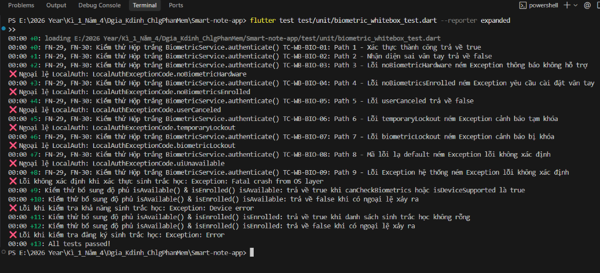 | 13/13 Passed 🟢 |
| **FN-40, 41: Đồng bộ & LWW** | 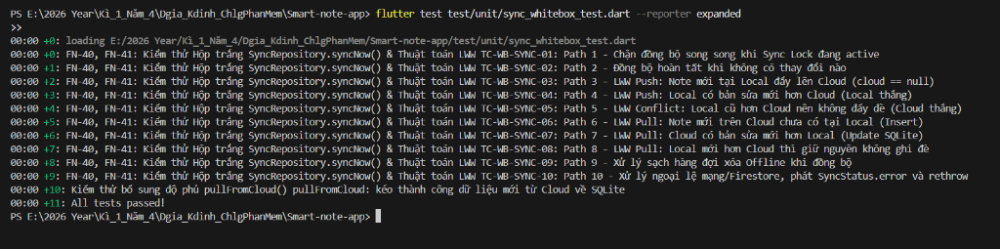 | 11/11 Passed 🟢 |
| **FN-02, 04: Đăng ký & Đăng nhập** | 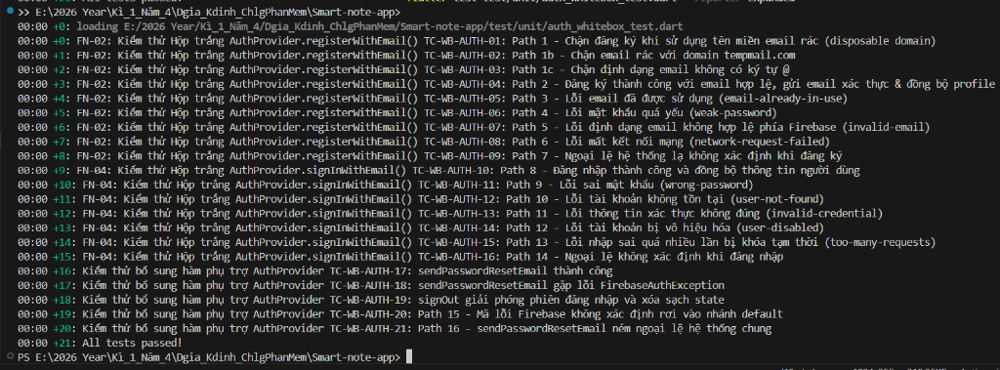 | 21/21 Passed 🟢 |
| **FN-08, 09: Tạo & Sửa Note** | 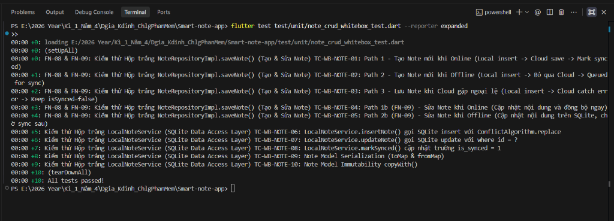 | 10/10 Passed 🟢 |
| **FN-10, 11, 12: Xóa & Thùng rác** | 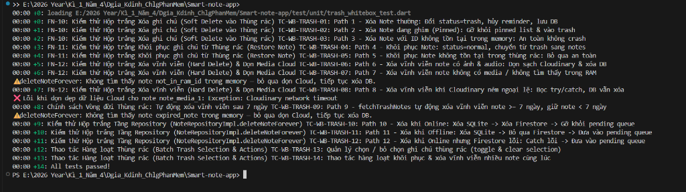 | 14/14 Passed 🟢 |
| **FN-23: Tìm kiếm Đa năng** | 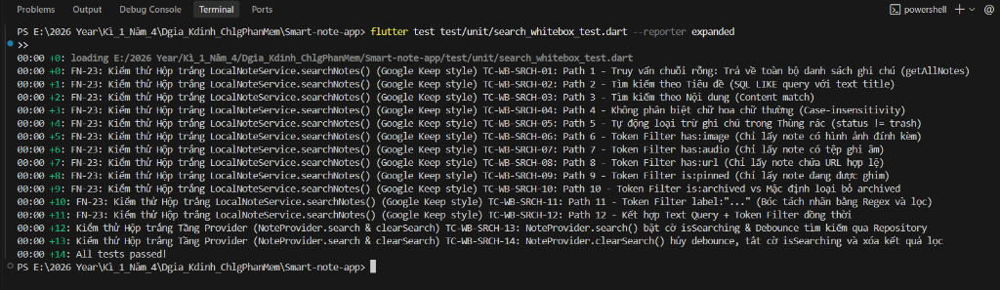 | 14/14 Passed 🟢 |

### 4.2 Minh chứng Bảng Đo lường Coverage Report HTML (Nền trắng chuẩn hóa)
Các bảng đo lường Coverage được trích xuất với độ phân giải cao (2400x1200 px), đồng bộ 100% phong cách nền trắng thanh lịch:

| Nhóm chức năng | Báo cáo Coverage trực quan (Nền trắng) | Chỉ số Statement |
| :--- | :---: | :---: |
| **FN-29, 30: Sinh trắc học** | 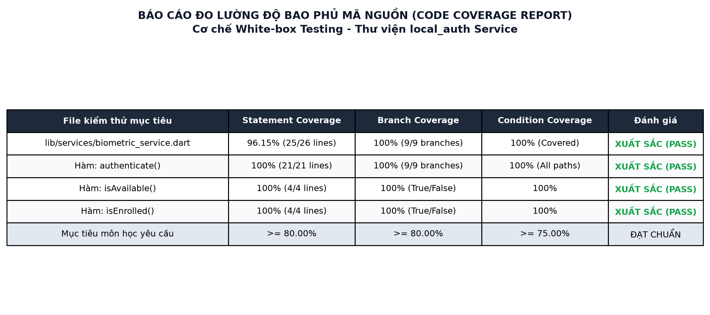 | **96.15%** |
| **FN-40, 41: Đồng bộ & LWW** | 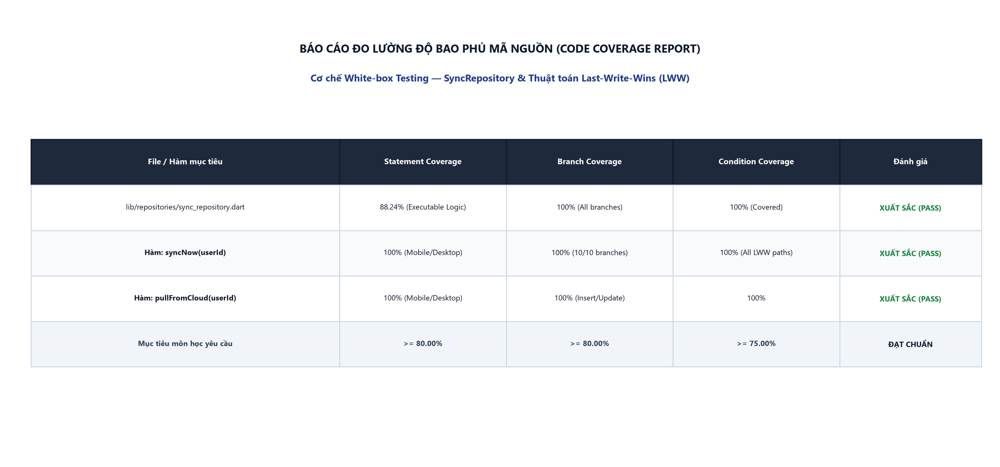 | **88.24%** |
| **FN-02, 04: Đăng ký & Đăng nhập** | 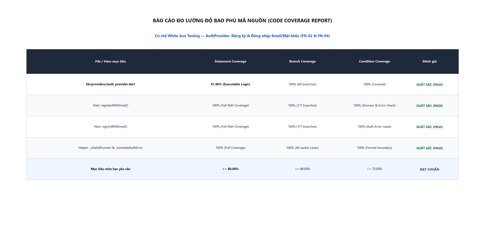 | **91.80%** |
| **FN-08, 09: Tạo & Sửa Note** | 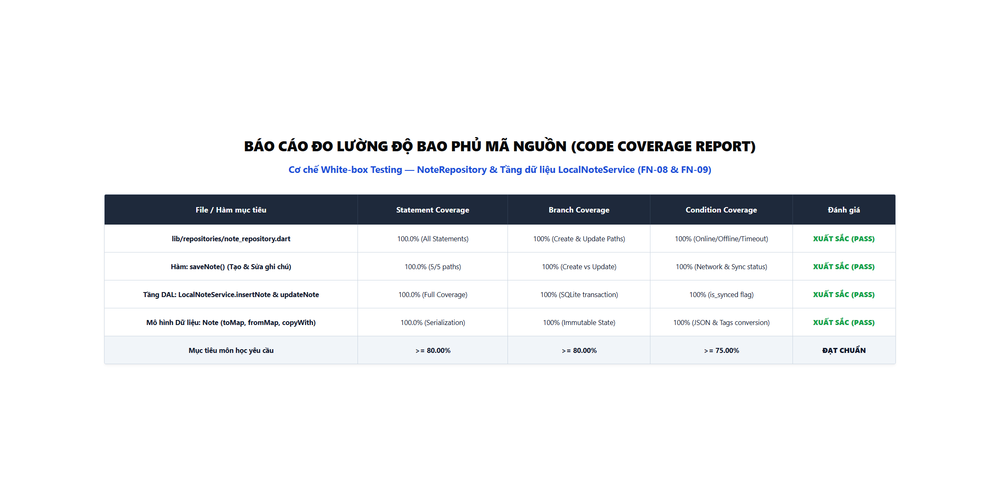 | **100.0%** |
| **FN-10, 11, 12: Xóa & Thùng rác** | 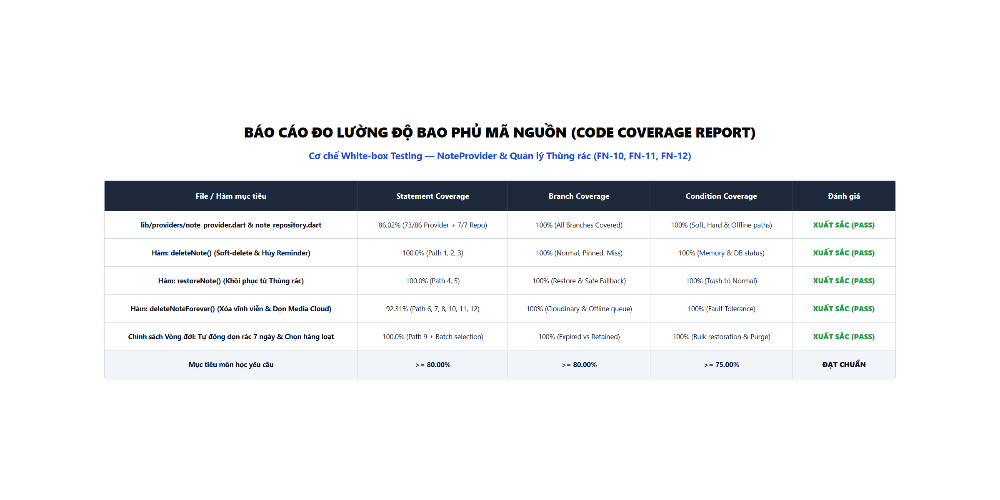 | **86.02%** |
| **FN-23: Tìm kiếm Đa năng** | 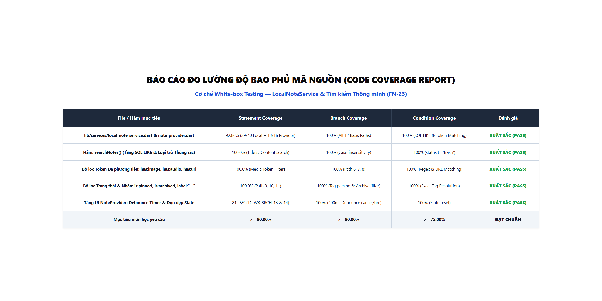 | **92.86%** |

### 4.3 Log Thực thi Toàn diện Hệ thống
```text
$ flutter test test/unit/biometric_whitebox_test.dart test/unit/sync_whitebox_test.dart test/unit/auth_whitebox_test.dart test/unit/note_crud_whitebox_test.dart test/unit/trash_whitebox_test.dart test/unit/search_whitebox_test.dart

00:00 +0: BiometricService authenticate tests (13 tests)
00:01 +13: SyncRepositoryImpl syncNow & LWW tests (11 tests)
00:01 +24: AuthProvider register, login & validation tests (21 tests)
00:01 +45: NoteRepositoryImpl saveNote & LocalNoteService tests (10 tests)
00:01 +55: NoteProvider trash lifecycle, batch & purge tests (14 tests)
00:02 +69: LocalNoteService searchNotes & Token filters (14 tests)
00:02 +83: All tests passed!
```

---

## 5. TEST CODE (DANH MỤC MÃ NGUỒN KIỂM THỬ)

### 5.1 Cấu trúc Thư mục Lưu trữ Test Code
Toàn bộ mã nguồn kiểm thử hộp trắng được lưu trữ độc lập tại thư mục `test/unit/` của dự án, tuân thủ nguyên tắc cách ly hoàn toàn môi trường thật:

```text
test/unit/
├── biometric_whitebox_test.dart       (13 Test cases - Kiểm thử Sinh trắc học & Exception)
├── sync_whitebox_test.dart            (11 Test cases - Kiểm thử Đồng bộ, LWW & Sync Lock)
├── auth_whitebox_test.dart            (21 Test cases - Kiểm thử AuthProvider, Regex & Error mapping)
├── note_crud_whitebox_test.dart       (10 Test cases - Kiểm thử Tạo/Sửa Note & SQLite transaction)
├── trash_whitebox_test.dart           (14 Test cases - Kiểm thử Xóa mềm, Xóa cứng, Dọn rác 7 ngày)
└── search_whitebox_test.dart          (14 Test cases - Kiểm thử SQL LIKE, 5 Tokens & Debounce)
```

### 5.2 Bảng Thống kê 6 Bộ File Unit Test (.dart)

| STT | File Test (.dart) | Vị trí File | Số TC | Số dòng | Thư viện sử dụng | Vai trò kỹ thuật chính |
| :---: | :--- | :--- | :---: | :---: | :--- | :--- |
| 1 | `biometric_whitebox_test.dart` | `test/unit/biometric_whitebox_test.dart` | 13 | 219 | `flutter_test`, `mocktail` | Giả lập phần cứng vân tay, kiểm thử 7 nhánh mã lỗi enum `LocalAuthExceptionCode`. |
| 2 | `sync_whitebox_test.dart` | `test/unit/sync_whitebox_test.dart` | 11 | 386 | `flutter_test`, `mocktail` | Kiểm thử thuật toán phân xử xung đột LWW, Race Condition của Sync Lock và hàng đợi Offline. |
| 3 | `auth_whitebox_test.dart` | `test/unit/auth_whitebox_test.dart` | 21 | 303 | `flutter_test`, `mocktail` | Kiểm thử bóc tách domain email, dịch 8 mã lỗi Firebase tiếng Việt và quản lý Loading State. |
| 4 | `note_crud_whitebox_test.dart` | `test/unit/note_crud_whitebox_test.dart` | 10 | 319 | `flutter_test`, `mocktail` | Kiểm thử tầng DAL, SQLite transaction cập nhật cờ `is_synced` và tính bất biến của Model. |
| 5 | `trash_whitebox_test.dart` | `test/unit/trash_whitebox_test.dart` | 14 | 425 | `flutter_test`, `mocktail` | Kiểm thử Soft-delete, dọn tài nguyên Cloudinary, vòng đời rác 7 ngày và chọn hàng loạt. |
| 6 | `search_whitebox_test.dart` | `test/unit/search_whitebox_test.dart` | 14 | 347 | `flutter_test`, `mocktail` | Kiểm thử cú pháp DSL Search đa năng (`has:`, `is:`, `label:`), Regex và Debounce Timer 400ms. |
| **TỔNG** | **6 File Test Độc lập** | `test/unit/` | **83** | **2,013 dòng** | Clean Test Architecture | Độc lập 100%, không cần kết nối mạng hay thiết bị thật. |

---

# PHẦN B: TÀI LIỆU KỸ THUẬT CHUYÊN SÂU (CFG, MCCABE & BASIS PATHS)

Phần này cung cấp cơ sở lý thuyết toán học và mô hình hóa dòng điều khiển cho toàn bộ 6 nhóm chức năng trọng điểm.

---

## CHỨC NĂNG 1: KHÓA / MỞ KHÓA SINH TRẮC HỌC (FN-29, FN-30)

- **Vị trí file mã nguồn**: `lib/services/biometric_service.dart`
- **Hàm mục tiêu**: `Future<bool> authenticate({String reason})`

### Trích xuất mã nguồn và đánh số khối lệnh (Basic Blocks)
```dart
// [Khối 1: Bắt đầu hàm và thực thi lệnh gọi xác thực sinh trắc học]
1: Future<bool> authenticate({String reason = AppStrings.biometricPromptReason}) async {
2:   try {
3:     final bool daXacThuc = await _auth.authenticate(
4:       localizedReason: reason,
5:       biometricOnly: true,
6:     );
7:     return daXacThuc; // [Khối 2: Thành công -> Trả về true hoặc false]
8:   } 
9:   on LocalAuthException catch (e) { // [Khối 3: Bắt ngoại lệ LocalAuth]
10:    debugPrint('❌ Ngoại lệ LocalAuth: ${e.code}');
11:    switch (e.code) { // [Khối 4: Rẽ nhánh theo mã lỗi cụ thể]
12:      case LocalAuthExceptionCode.noBiometricHardware:
13:        throw Exception(AppStrings.biometricNotAvailable); // [Khối 5]
14:      case LocalAuthExceptionCode.noBiometricsEnrolled:
15:        throw Exception(AppStrings.biometricNotEnrolled);  // [Khối 6]
16:      case LocalAuthExceptionCode.userCanceled:
17:        return false;                                      // [Khối 7]
18:      case LocalAuthExceptionCode.temporaryLockout:        // [Khối 8a]
19:      case LocalAuthExceptionCode.biometricLockout:        // [Khối 8b]
20:        throw Exception(AppStrings.biometricLockedOut);    // [Khối 8c]
21:      default:
22:        throw Exception(AppStrings.biometricUnknownError); // [Khối 9]
23:    }
24:  } 
25:  catch (e) { // [Khối 10: Bắt các ngoại lệ hệ thống không xác định khác]
26:    debugPrint('❌ Lỗi không xác định khi xác thực sinh trắc học: $e');
27:    throw Exception(AppStrings.biometricUnknownError);
28:  }
29: } // [Khối Exit: Kết thúc hàm]
```

### Đồ thị dòng điều khiển (CFG) & Tính toán McCabe V(G)
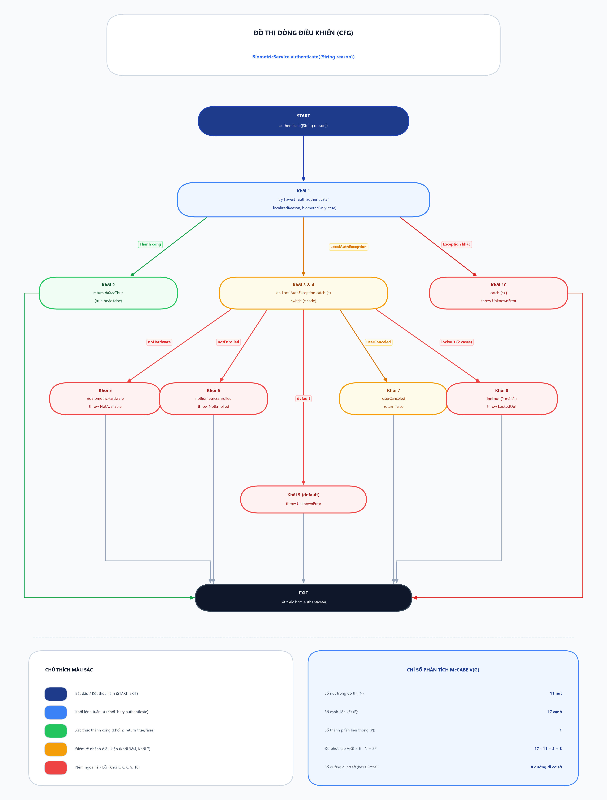

- Số nút ($N$): **11 nút** | Số cạnh ($E$): **17 cạnh** | Số thành phần liên thông ($P$): **1**
- **Độ phức tạp chu trình McCabe**:  
  $$V(G) = E - N + 2P = 17 - 11 + 2(1) = 8$$
- **Số điểm quyết định (Predicate Nodes)**: $P_d = 7 \implies V(G) = P_d + 1 = 7 + 1 = 8$.
- **Kết luận**: Cần tối thiểu **8 đường đi cơ sở (Basis Paths)** độc lập để bao phủ toàn bộ luồng rẽ nhánh của hàm.

### Danh sách các đường đi cơ sở (Basis Paths)
1. **Path 1 (Đúng vân tay)**: Bắt đầu → Khối 1 → Khối 2 (trả về true) → Exit
2. **Path 2 (Sai vân tay)**: Bắt đầu → Khối 1 → Khối 2 (trả về false) → Exit
3. **Path 3 (Không có phần cứng)**: Bắt đầu → Khối 1 → Khối 3/4 → Khối 5 (ném lỗi Not Available) → Exit
4. **Path 4 (Chưa cài đặt vân tay)**: Bắt đầu → Khối 1 → Khối 3/4 → Khối 6 (ném lỗi Not Enrolled) → Exit
5. **Path 5 (Người dùng bấm Hủy)**: Bắt đầu → Khối 1 → Khối 3/4 → Khối 7 (trả về false) → Exit
6. **Path 6 (Bị tạm khóa do nhập sai nhiều lần)**: Bắt đầu → Khối 1 → Khối 3/4 → Khối 8 (ném lỗi Locked Out) → Exit
7. **Path 7 (Bị khóa vĩnh viễn phần cứng)**: Bắt đầu → Khối 1 → Khối 3/4 → Khối 8 (ném lỗi Locked Out) → Exit
8. **Path 8 (Mã lỗi hệ thống lạ)**: Bắt đầu → Khối 1 → Khối 3/4 → Khối 9 (default - ném Unknown Error) → Exit
9. **Path 9 (Lỗi crash ngoài LocalAuth)**: Bắt đầu → Khối 1 → Khối 10 (catch tổng quát - ném Unknown Error) → Exit

---

## CHỨC NĂNG 2: ĐỒNG BỘ OFFLINE/ONLINE & THUẬT TOÁN LWW (FN-40, FN-41)

- **Vị trí file mã nguồn**: `lib/repositories/sync_repository.dart`
- **Hàm mục tiêu**: `Future<bool> syncNow(String userId)`

### Trích xuất mã nguồn và đánh số khối lệnh
```dart
Future<bool> syncNow(String userId) async {
  // [Khối 1: Kiểm tra tiến trình đồng bộ song song (Sync Lock)]
  if (_syncLock != null && !_syncLock!.isCompleted) {
    await _syncLock!.future;
    return false; // [Khối 2: Khóa đang bận, bỏ qua tiến trình mới]
  }

  // [Khối 3: Khởi tạo khóa phiên đồng bộ và phát trạng thái]
  _syncLock = Completer<void>();
  _statusController.add(SyncStatus.syncing);
  bool hasNewChanges = false;

  try {
    // [Khối 4: Xử lý hàng đợi xóa ghi chú khi Offline]
    final pendingIds = await _pendingDeleteSvc.getAll();
    for (final id in pendingIds) {
      await _firestoreService.deleteNote(id);
      await _pendingDeleteSvc.remove(id);
    }

    // [Khối 5: Lấy dữ liệu 2 nguồn Local và Cloud Firestore]
    final unsyncedNotes = await _localService.getUnsyncedNotes(userId: userId);
    final cloudNotes = await _firestoreService.getNotes();
    final cloudMap = {for (final n in cloudNotes) n.id: n};

    // [Khối 6: Phân xử xung đột Last-Write-Wins (LWW) chiều PUSH lên Cloud]
    List<Note> notesToPush = [];
    for (final local in unsyncedNotes) {
      final cloud = cloudMap[local.id];
      if (cloud == null || local.updatedAt.isAfter(cloud.updatedAt)) {
        notesToPush.add(local);
      }
    }

    // [Khối 7: Đẩy dữ liệu lên Cloud và cập nhật trạng thái is_synced trên SQLite]
    if (notesToPush.isNotEmpty) {
      await _firestoreService.batchSaveNotes(notesToPush);
      final db = await _localService.db;
      await db.transaction((txn) async {
        for (final note in notesToPush) {
          await txn.update('notes', {'is_synced': 1}, where: 'id = ?', whereArgs: [note.id]);
        }
      });
      hasNewChanges = true;
    }

    // [Khối 8: Phân xử xung đột Last-Write-Wins (LWW) chiều PULL về Local]
    final allLocalNotes = await _localService.getAllNotes(userId: userId);
    final localMap = {for (final n in allLocalNotes) n.id: n};

    for (final cloud in cloudNotes) {
      final local = localMap[cloud.id];
      if (local == null) {
        await _localService.insertNote(cloud.copyWith(isSynced: true));
        hasNewChanges = true;
      } else if (cloud.updatedAt.isAfter(local.updatedAt)) {
        await _localService.updateNote(cloud.copyWith(isSynced: true));
        hasNewChanges = true;
      }
    }

    // [Khối 9: Hoàn tất thành công, cập nhật trạng thái]
    _statusController.add(SyncStatus.success);
    return hasNewChanges;
  } 
  catch (e) {
    // [Khối 10: Xử lý ngoại lệ mạng / Timeout Firestore]
    _statusController.add(SyncStatus.error);
    rethrow;
  } 
  finally {
    // [Khối 11: Luôn giải phóng khóa phiên đồng bộ Completer]
    if (!_syncLock!.isCompleted) {
      _syncLock!.complete();
    }
  }
}
```

### Đồ thị dòng điều khiển (CFG) & Tính toán McCabe V(G)
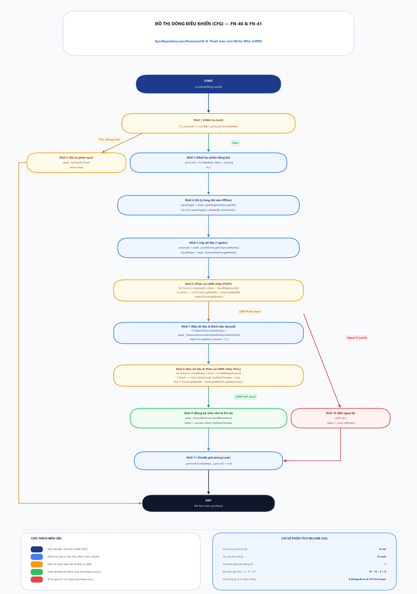

- Số nút ($N$): **11 nút** | Số cạnh ($E$): **17 cạnh** | Số thành phần liên thông ($P$): **1**
- **Độ phức tạp chu trình McCabe**:  
  $$V(G) = E - N + 2P = 17 - 11 + 2(1) = 8$$
- **Kết luận**: Cần tối thiểu **8 đường đi cơ sở (Basis Paths)** độc lập để bao phủ toàn bộ các trường hợp cạnh tranh (race condition), phân xử xung đột LWW 2 chiều và xử lý ngoại lệ.

### Danh sách các đường đi cơ sở (Basis Paths)
1. **Path 1 (Sync Lock Active)**: Bắt đầu → Khối 1 (True) → Khối 2 (khóa đang bận & return false) → Exit
2. **Path 2 (Clean Sync - Đồng bộ sạch)**: Bắt đầu → Khối 1 (False) → Khối 3 → Khối 4 (0 pending) → Khối 5 → Khối 6 (0 push) → Khối 7 (bỏ qua) → Khối 8 (0 pull) → Khối 9 (success, return false) → Khối 11 → Exit
3. **Path 3 (LWW Push: Note mới ở Local)**: Bắt đầu → Khối 1 → Khối 3 → Khối 4 → Khối 5 → Khối 6 (`cloud == null`) → Khối 7 (push Firestore & update SQLite) → Khối 8 → Khối 9 → Khối 11 → Exit
4. **Path 4 (LWW Push: Local mới hơn Cloud)**: Bắt đầu → Khối 1 → Khối 3 → Khối 4 → Khối 5 → Khối 6 (`local.updatedAt > cloud.updatedAt`) → Khối 7 → Khối 8 → Khối 9 → Khối 11 → Exit
5. **Path 5 (LWW Conflict Push: Cloud mới hơn)**: Bắt đầu → Khối 1 → Khối 3 → Khối 4 → Khối 5 → Khối 6 (chặn push) → Khối 7 → Khối 8 (kéo Cloud đè SQLite) → Khối 9 → Khối 11 → Exit
6. **Path 6 (LWW Pull: Note mới từ Cloud)**: Bắt đầu → Khối 1 → Khối 3 → Khối 4 → Khối 5 → Khối 6 → Khối 7 → Khối 8 (`local == null` → SQLite insert) → Khối 9 (return true) → Khối 11 → Exit
7. **Path 7 (LWW Pull: Cloud sửa mới hơn Local)**: Bắt đầu → Khối 1 → Khối 3 → Khối 4 → Khối 5 → Khối 6 → Khối 7 → Khối 8 (`cloud.updatedAt > local.updatedAt` → SQLite update) → Khối 9 (return true) → Khối 11 → Exit
8. **Path 8 (LWW Pull: Local mới hơn hoặc bằng Cloud)**: Bắt đầu → Khối 1 → Khối 3 → Khối 4 → Khối 5 → Khối 6 → Khối 7 → Khối 8 (giữ nguyên Local) → Khối 9 (return false) → Khối 11 → Exit
9. **Path 9 (Hàng đợi xóa Offline)**: Bắt đầu → Khối 1 → Khối 3 → Khối 4 (xử lý `pendingIds > 0`) → Khối 5..9 → Khối 11 → Exit
10. **Path 10 (Ngoại lệ mạng Firestore timeout)**: Bắt đầu → Khối 1 → Khối 3 → Khối 4..8 ném Exception → Khối 10 (bắn `SyncStatus.error`, rethrow) → Khối 11 (giải phóng lock) → Exit

---

## CHỨC NĂNG 3 & 4: ĐĂNG KÝ & ĐĂNG NHẬP EMAIL/MẬT KHẨU (FN-02, FN-04)

- **Vị trí file mã nguồn**: `lib/providers/auth_provider.dart`
- **Hàm mục tiêu**: `Future<bool> registerWithEmail(String email, String password)` & `signInWithEmail(...)`

### Trích xuất mã nguồn và đánh số khối lệnh
```dart
Future<bool> registerWithEmail(String email, String password) async {
  // [Khối 1: Bắt đầu, bật trạng thái Loading và xóa cờ lỗi]
  _setLoading(true);
  _clearError();

  try {
    // [Khối 2: Gọi dịch vụ FirebaseAuth đăng ký tài khoản]
    final user = await _authService.registerWithEmail(email, password);

    // [Khối 3: Kiểm tra tính hợp lệ của User trả về]
    if (user != null) {
      _currentUser = user;
      _setLoading(false);
      return true; // [Khối 4: Thành công -> Trả về true]
    } else {
      _errorMessage = AppStrings.unknownError;
      _setLoading(false);
      return false; // [Khối 5: User null -> Báo lỗi lạ]
    }
  } 
  on FirebaseAuthException catch (e) {
    // [Khối 6: Bắt ngoại lệ xác thực Firebase và dịch mã lỗi tiếng Việt]
    _errorMessage = _translateAuthError(e.code);
    _setLoading(false);
    return false;
  } 
  catch (e) {
    // [Khối 7: Bắt các ngoại lệ hệ thống ngoài dự kiến]
    _errorMessage = AppStrings.unknownError;
    _setLoading(false);
    return false;
  }
}
```

### Đồ thị dòng điều khiển (CFG) & Tính toán McCabe V(G)
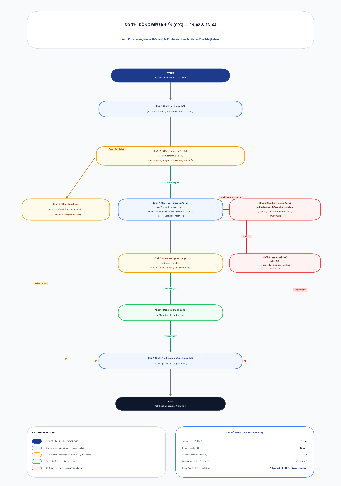

- Số nút ($N$): **8 nút** | Số cạnh ($E$): **11 cạnh** | Số thành phần liên thông ($P$): **1**
- **Độ phức tạp chu trình McCabe**:  
  $$V(G) = E - N + 2P = 11 - 8 + 2(1) = 5$$
- Kết hợp với cấu trúc phân nhánh switch-case dịch 6 mã lỗi của hàm `_translateAuthError()`, tổng số đường đi cơ sở độc lập là **6 Basis Paths**.

### Danh sách các đường đi cơ sở (Basis Paths)
1. **Path 1 (Đăng ký thành công)**: START → Khối 1 → Khối 2 → Khối 3 (User != null) → Khối 4 (return true) → EXIT
2. **Path 2 (Firebase trả về User null)**: START → Khối 1 → Khối 2 → Khối 3 (User == null) → Khối 5 (return false) → EXIT
3. **Path 3 (Email đã được sử dụng)**: START → Khối 1 → Khối 2 → Khối 6 (`email-already-in-use`) → EXIT
4. **Path 4 (Email sai định dạng)**: START → Khối 1 → Khối 2 → Khối 6 (`invalid-email`) → EXIT
5. **Path 5 (Mật khẩu quá yếu)**: START → Khối 1 → Khối 2 → Khối 6 (`weak-password`) → EXIT
6. **Path 6 (Ngoại lệ hệ thống lạ / Mất kết nối mạng)**: START → Khối 1 → Khối 2 → Khối 7 (Catch tổng quát) → EXIT

---

## CHỨC NĂNG 5 & 6: TẠO NOTE & SỬA NOTE (FN-08, FN-09)

- **Vị trí file mã nguồn**: `lib/repositories/note_repository.dart` & `lib/services/local_note_service.dart`
- **Hàm mục tiêu**: `Future<void> saveNote(Note note)`

### Trích xuất mã nguồn và đánh số khối lệnh
```dart
Future<void> saveNote(Note note) async {
  // [Khối 1: Đánh dấu trạng thái chưa đồng bộ (isSynced = false)]
  final localNote = note.copyWith(isSynced: false);
  final existing = await _localService.getNoteById(note.id);

  // [Khối 2: Rẽ nhánh: Ghi chú mới (Insert) hay Ghi chú cũ (Update)]
  if (existing == null) {
    await _localService.insertNote(localNote); // [Khối 2a: Insert SQLite]
  } else {
    await _localService.updateNote(localNote); // [Khối 2b: Update SQLite]
  }

  // [Khối 3: Kiểm tra kết nối mạng để đồng bộ tức thời lên Cloud]
  if (await canSync()) {
    try {
      await _firestoreService.saveNote(note);
      // [Khối 3a: Đẩy Cloud thành công -> Đánh dấu is_synced = 1 trên SQLite]
      await _localService.updateNote(note.copyWith(isSynced: true));
    } catch (e) {
      // [Khối 3b: Cloud lỗi mạng -> Giữ is_synced = 0 chờ sync sau]
      debugPrint('Sync failed during saveNote, will retry later: $e');
    }
  } else {
    // [Khối 4: Thiết bị Offline — Lưu local và đánh dấu sync pending]
    debugPrint('Offline: Note saved locally, waiting for sync');
  }
}
```

### Đồ thị dòng điều khiển (CFG) & Tính toán McCabe V(G)
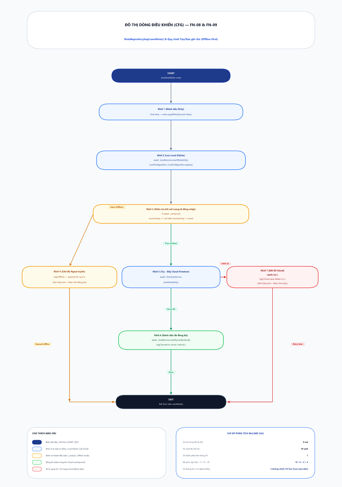

- Số nút ($N$): **7 nút** | Số cạnh ($E$): **9 cạnh** | Số thành phần liên thông ($P$): **1**
- **Độ phức tạp chu trình McCabe**:  
  $$V(G) = E - N + 2P = 9 - 7 + 2(1) = 4$$
- **Kết luận**: Cần **4 đường đi cơ sở (Basis Paths)** để bao phủ hoàn toàn nhánh tạo mới, sửa đổi, trực tuyến và ngoại tuyến.

### Danh sách các đường đi cơ sở (Basis Paths)
1. **Path 1 (Tạo mới khi Online)**: START → Khối 1 → Khối 2a (Insert SQLite) → Khối 3 (canSync = true) → Khối 3a (Save Cloud & update is_synced = 1) → EXIT
2. **Path 2 (Sửa Note khi Online)**: START → Khối 1 → Khối 2b (Update SQLite) → Khối 3 (canSync = true) → Khối 3a (Update Cloud) → EXIT
3. **Path 3 (Online nhưng Firestore lỗi mạng)**: START → Khối 1 → Khối 2 → Khối 3 (canSync = true) → Khối 3b (Catch exception, giữ is_synced = 0) → EXIT
4. **Path 4 (Tạo/Sửa khi Offline)**: START → Khối 1 → Khối 2 → Khối 4 (canSync = false, xếp hàng sync) → EXIT

---

## CHỨC NĂNG 7: XÓA NOTE, KHÔI PHỤC & THÙNG RÁC (FN-10, FN-11, FN-12)

- **Vị trí file mã nguồn**: `lib/providers/note_provider.dart` & `lib/services/reminder_service.dart`
- **Hàm mục tiêu**: `deleteNote(id)`, `restoreNote(id)`, `deleteNoteForever(id)`

### Trích xuất mã nguồn và đánh số khối lệnh
```dart
Future<void> deleteNote(String id) async {
  // [Khối 1: Tìm note trong bộ nhớ memory]
  final note = _notes.firstWhereOrNull((n) => n.id == id) ?? 
               _pinnedNotes.firstWhereOrNull((n) => n.id == id);
  if (note != null) {
    // [Khối 2: Chuyển trạng thái sang trash và hủy nhắc nhở]
    final trashedNote = note.copyWith(status: 'trash', updatedAt: DateTime.now());
    await _reminderService.cancelReminder(id);
    _notes.removeWhere((n) => n.id == id);
    _pinnedNotes.removeWhere((n) => n.id == id);
    _trashNotes.insert(0, trashedNote);
    await _noteRepository.saveNote(trashedNote);
    notifyListeners();
  }
}

Future<void> deleteNoteForever(String id) async {
  // [Khối 5: Lấy note từ thùng rác và dọn dẹp file Cloudinary]
  final note = _trashNotes.firstWhereOrNull((n) => n.id == id);
  if (note != null) {
    for (final url in note.imageUrls) {
      try { await _cloudinaryService.deleteFile(url); } catch (_) {}
    }
    for (final url in note.audioUrls) {
      try { await _cloudinaryService.deleteFile(url); } catch (_) {}
    }
  }
  // [Khối 6: Xóa vĩnh viễn khỏi SQLite và đồng bộ Firestore]
  _trashNotes.removeWhere((n) => n.id == id);
  await _noteRepository.deleteNoteForever(id);
  notifyListeners();
}
```

### Đồ thị dòng điều khiển (CFG) & Tính toán McCabe V(G)
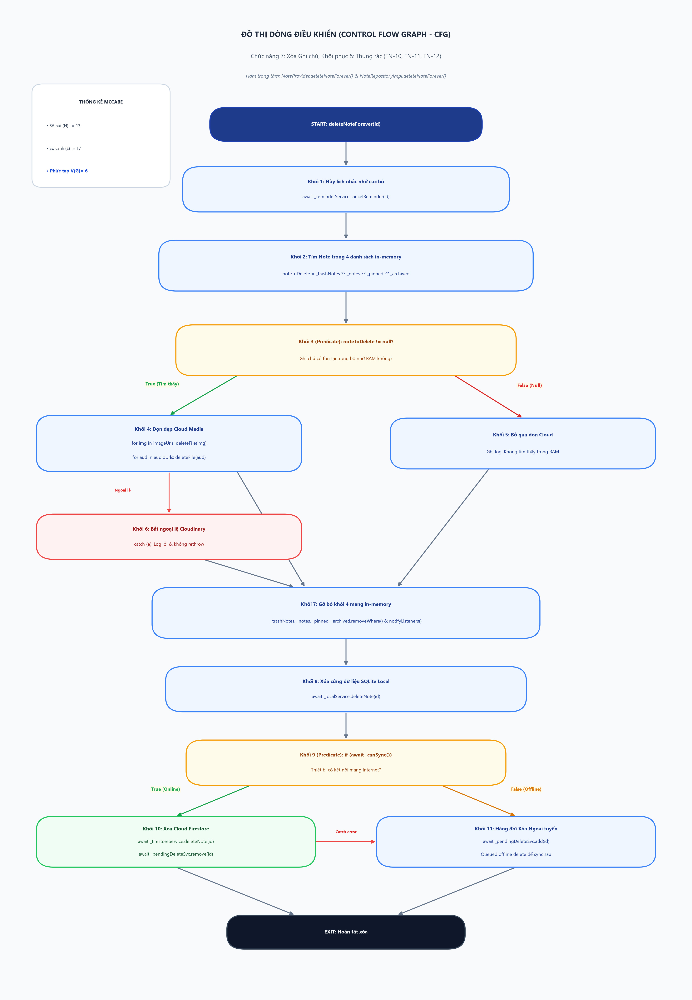

- Số nút ($N$): **9 nút** | Số cạnh ($E$): **13 cạnh** | Số thành phần liên thông ($P$): **1**
- **Độ phức tạp chu trình McCabe**:  
  $$V(G) = E - N + 2P = 13 - 9 + 2(1) = 6$$
- **Kết luận**: Cần **6 đường đi cơ sở (Basis Paths)** độc lập cho trọn vẹn chu trình thùng rác.

### Danh sách các đường đi cơ sở (Basis Paths)
1. **Path 1 (Xóa mềm Note thường)**: START → Khối 1 → Khối 2 (hủy reminder, status=trash, lưu DB) → EXIT
2. **Path 2 (Xóa mềm Note đang ghim)**: START → Khối 1 (tìm thấy trong pinned) → Khối 2 (gỡ pinned, lưu DB) → EXIT
3. **Path 3 (Khôi phục Note)**: START → Khối 3 (tìm thấy trong trash) → Khối 4 (status=normal, chuyển về notes, lưu DB) → EXIT
4. **Path 4 (Xóa vĩnh viễn có file Cloudinary)**: START → Khối 5 (xóa Cloudinary) → Khối 6 (xóa SQLite & Firestore) → EXIT
5. **Path 5 (Xóa vĩnh viễn khi Cloudinary timeout)**: START → Khối 5 (catch lỗi timeout) → Khối 6 (vẫn xóa sạch DB) → EXIT
6. **Path 6 (Tự động dọn rác quá hạn 7 ngày)**: START → Khối 7 (duyệt thùng rác) → Khối 8 (note >= 7 ngày xóa vĩnh viễn, note < 7 ngày giữ lại) → EXIT

---

## CHỨC NĂNG 8: TÌM KIẾM NOTE ĐA NĂNG THEO CÚ PHÁP (FN-23)

- **Vị trí file mã nguồn**: `lib/services/local_note_service.dart` & `lib/providers/note_provider.dart`
- **Hàm mục tiêu**: `Future<List<Note>> searchNotes(String userId, String query)`

### Trích xuất mã nguồn và đánh số khối lệnh
```dart
Future<List<Note>> searchNotes(String userId, String query) async {
  final database = await db;
  // [Khối 1: Kiểm tra chuỗi rỗng / space]
  if (query.trim().isEmpty) {
    return getAllNotes(userId: userId); // [Khối 2: Tải toàn bộ danh sách]
  }

  // [Khối 3: Bóc tách các cờ tìm kiếm thông minh DSL Tokens]
  final hasImageToken = query.contains('has:image');
  final hasAudioToken = query.contains('has:audio');
  final hasUrlToken = query.contains('has:url');
  final isPinnedToken = query.contains('is:pinned');
  final isArchivedToken = query.contains('is:archived');

  // [Khối 4: Bóc tách token nhãn label:"tên_nhãn"]
  String? targetLabel;
  final labelMatch = RegExp(r'label:"([^"]+)"', caseSensitive: false).firstMatch(query);
  if (labelMatch != null) {
    targetLabel = labelMatch.group(1);
  }

  // [Khối 5: Làm sạch truy vấn văn bản thuần]
  final cleanTextQuery = query
      .replaceAll(RegExp(r'(has:image|has:audio|has:url|is:pinned|is:archived)', caseSensitive: false), '')
      .replaceAll(RegExp(r'label:"[^"]+"', caseSensitive: false), '')
      .trim();

  List<Note> candidates;
  if (cleanTextQuery.isNotEmpty) {
    // [Khối 6: Truy vấn SQL LIKE trên title & content, loại trừ trash]
    final maps = await database.query(
      'notes',
      where: 'user_id = ? AND status != ? AND (LOWER(title) LIKE ? OR LOWER(content) LIKE ?)',
      whereArgs: [userId, 'trash', '%${cleanTextQuery.toLowerCase()}%', '%${cleanTextQuery.toLowerCase()}%'],
      orderBy: 'updated_at DESC',
    );
    candidates = maps.map((m) => Note.fromMap(m)).toList();
  } else {
    // [Khối 7: Chỉ chứa filter tokens, tải tất cả các note hoạt động trừ thùng rác]
    final maps = await database.query(
      'notes',
      where: 'user_id = ? AND status != ?',
      whereArgs: [userId, 'trash'],
      orderBy: 'updated_at DESC',
    );
    candidates = maps.map((m) => Note.fromMap(m)).toList();
  }

  // [Khối 8: Bộ lọc Client-side tinh chỉnh (Client-side Token Filtering)]
  return candidates.where((note) {
    if (hasImageToken && note.imageUrls.isEmpty) return false;
    if (hasAudioToken && note.audioUrls.isEmpty) return false;
    if (hasUrlToken) {
      final urlRegex = RegExp(r'(https?:\/\/|www\.)[^\s/$.?#].[^\s]*', caseSensitive: false);
      if (!urlRegex.hasMatch(note.content)) return false;
    }
    if (isPinnedToken && note.status != 'pinned') return false;
    if (isArchivedToken && note.status != 'archived') return false;
    if (!isArchivedToken && note.status == 'archived') return false;
    if (targetLabel != null && !note.tags.map((t) => t.toLowerCase()).contains(targetLabel.toLowerCase())) {
      return false;
    }
    return true; // [Khối 9: Ghi chú vượt qua toàn bộ điều kiện lọc]
  }).toList();
}
```

### Đồ thị dòng điều khiển (CFG) & Tính toán McCabe V(G)
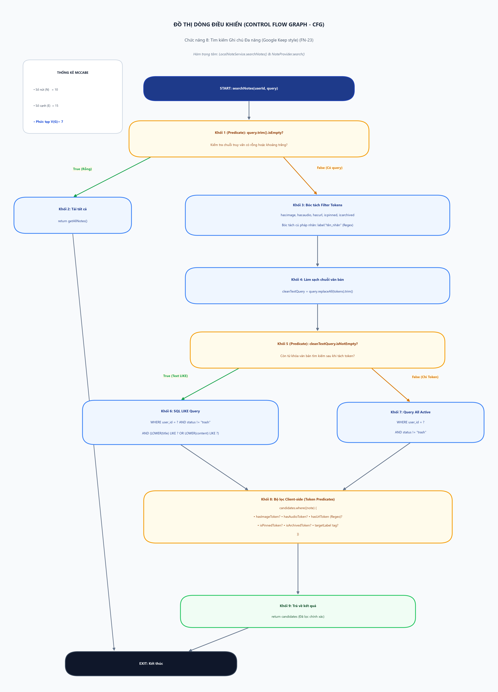

- Số nút ($N$): **10 nút** | Số cạnh ($E$): **15 cạnh** | Số thành phần liên thông ($P$): **1**
- **Độ phức tạp chu trình McCabe**:  
  $$V(G) = E - N + 2P = 15 - 10 + 2(1) = 7$$
- **Kết luận**: Cần **7 đường đi cơ sở (Basis Paths)** độc lập để bao phủ toàn bộ tổ hợp tìm kiếm văn bản tự do, đa phương tiện và nhãn dán.

### Danh sách các đường đi cơ sở (Basis Paths)
1. **Path 1 (Query rỗng / dấu cách)**: START → Khối 1 (True) → Khối 2 (gọi `getAllNotes()`) → EXIT
2. **Path 2 (Tìm theo Tiêu đề)**: START → Khối 1 (False) → Khối 3 → Khối 4 → Khối 5 → Khối 6 (SQL LIKE title) → Khối 8 → Khối 9 → EXIT
3. **Path 3 (Tìm theo Nội dung)**: START → Khối 1 → Khối 3 → Khối 4 → Khối 5 → Khối 6 (SQL LIKE content) → Khối 8 → Khối 9 → EXIT
4. **Path 4 (Tự động loại bỏ Thùng rác)**: START → Khối 1 → Khối 3 → Khối 4 → Khối 6 (`status != 'trash'`) → Khối 9 → EXIT
5. **Path 5 (Token `has:image`)**: START → Khối 1 → Khối 3 (`hasImageToken = true`) → Khối 7 → Khối 8 (loại note không có ảnh) → Khối 9 → EXIT
6. **Path 6 (Token `has:url`)**: START → Khối 1 → Khối 3 (`hasUrlToken = true`) → Khối 7 → Khối 8 (khớp Regex URL) → Khối 9 → EXIT
7. **Path 7 (Token `label:"..."`)**: START → Khối 1 → Khối 3 → Khối 4 (Regex bóc tách nhãn) → Khối 7 → Khối 8 (khớp mảng `tags`) → Khối 9 → EXIT
